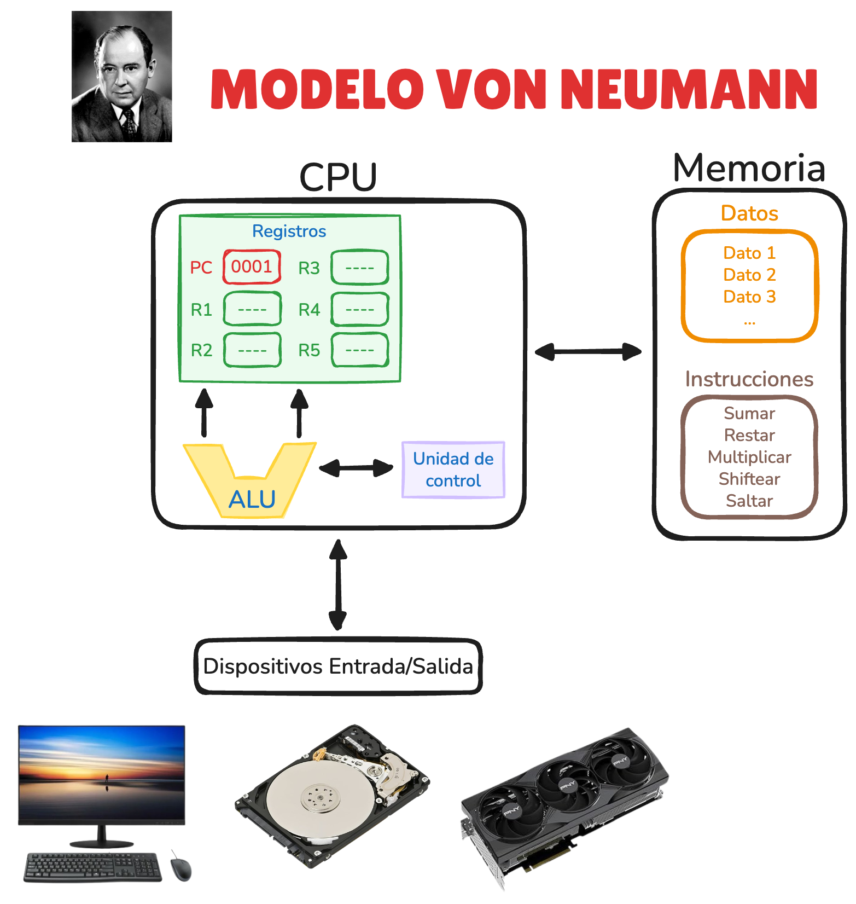
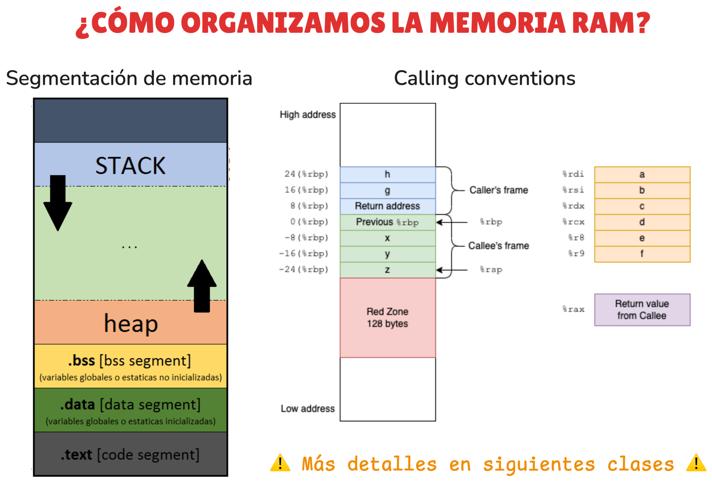
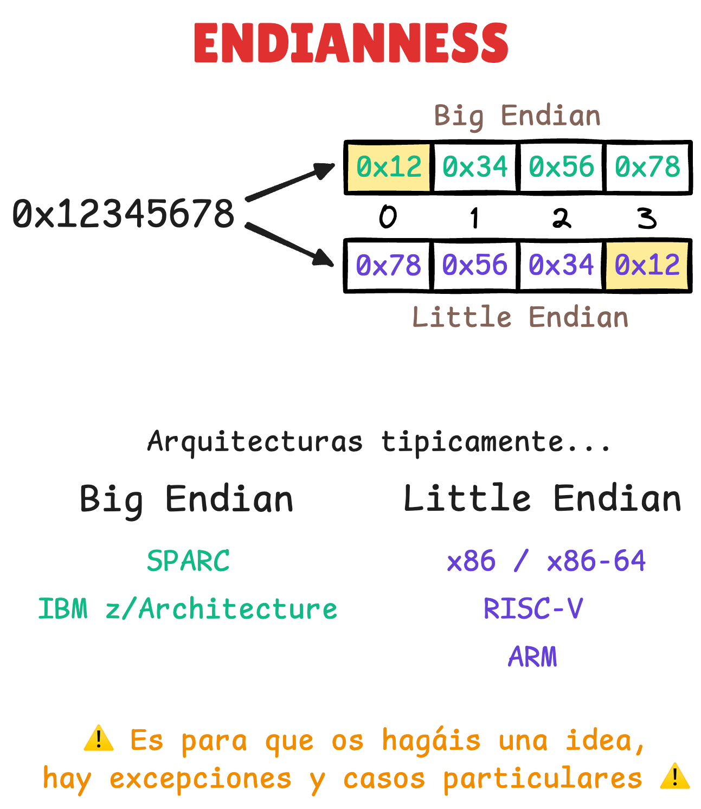

### Enlaces

- **Manuales de arquitectura**
    - [Intel® 64 and IA-32 Architectures Software Developer Manuals](https://www.intel.com/content/www/us/en/developer/articles/technical/intel-sdm.html)
    - [AVR® Instruction Set Manual](https://ww1.microchip.com/downloads/en/devicedoc/AVR-Instruction-Set-Manual-DS40002198A.pdf)
    - [V850ES/SJ3 User's Manual](https://www.renesas.com/en/products/v850es-sj3)

- **ISA y assembly**
    - [CPU Simulator](https://cpuvisualsimulator.github.io)
    - [Stack Overflow: Are instruction set and assembly language the same thing?](https://stackoverflow.com/questions/5382130/are-instruction-set-and-assembly-language-the-same-thing)

- **Endianness**
    - [GeeksForGeeks: What is Endianness? Big-Endian & Little-Endian](https://www.geeksforgeeks.org/dsa/little-and-big-endian-mystery)

- **Compilación**
    - [Compiling a C Program: Behind the Scenes](https://www.geeksforgeeks.org/c/compiling-a-c-program-behind-the-scenes)

### Documentos

- [diagrama_clase.excalidraw](resources/diagrama_clase.excalidraw)

    - **Modelo de Von Neumann**
    <p align="center">
        
    </p>

    - **Organización de la memoria**
    <p align="center">
        
    </p>

    - **Endianness**
    <p align="center">
        
    </p>

### Snippets

- Script para demo de ISA (`demo_isa.c`)
    - Código
        ```c
        #include <stdint.h>

        __attribute__((noinline))
        uint32_t add32(uint32_t a, uint32_t b) {
            return a + b;
        }
        ```
    - Compilación
        ```sh
        gcc -m64 -O2 -S -masm=intel demo_isa.c -o demo_x86_64.s
        ```
        ```sh
        avr-gcc -mmcu=atmega328p -Os -S demo_isa.c -o demo_avr.s
        ```

- Script para demo endianness (`demo_endian.c`)
    - Código
        ```c
        #include <stdio.h>
        #include <stdint.h>

        int main() {
            uint32_t x = 0x12345678;
            unsigned char *p = (unsigned char*)&x;

            for (int i = 0; i < 4; i++) {
                printf("%02x ", p[i]);
            }
            puts("");
            return 0;
        }
        ```

    - Compilación
        ```sh
        gcc -O0 demo_endian.c -o demo_endian
        ```
