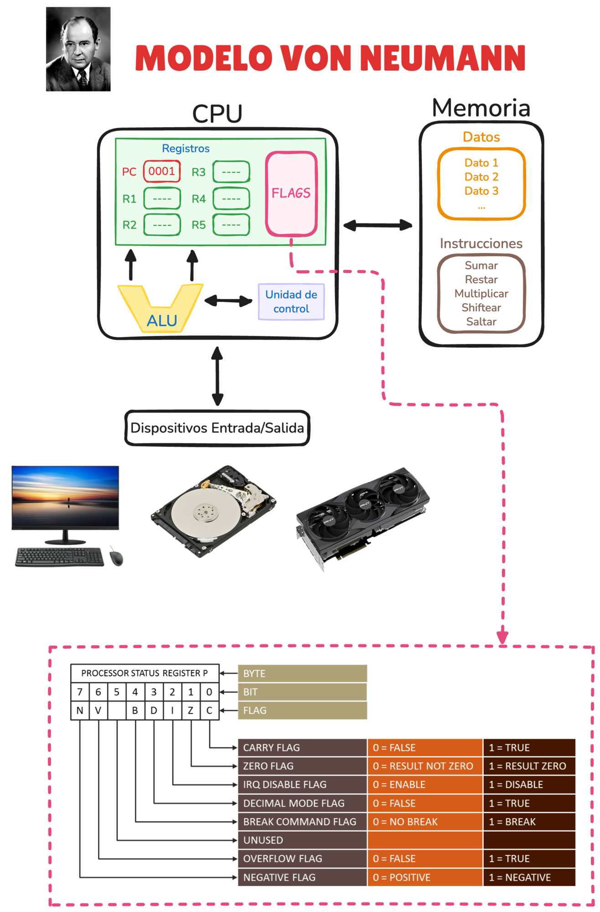
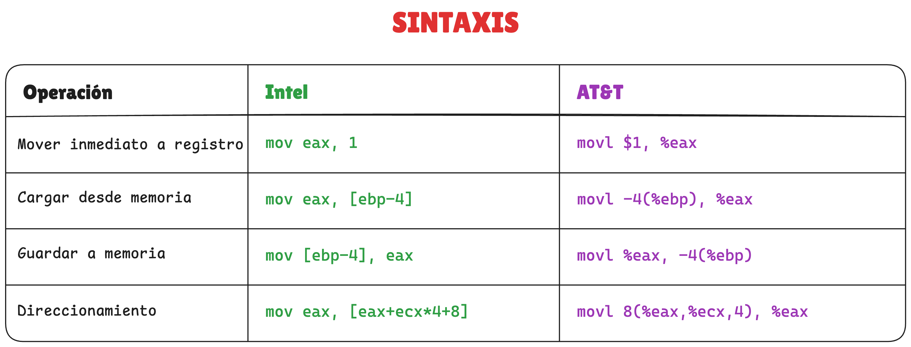
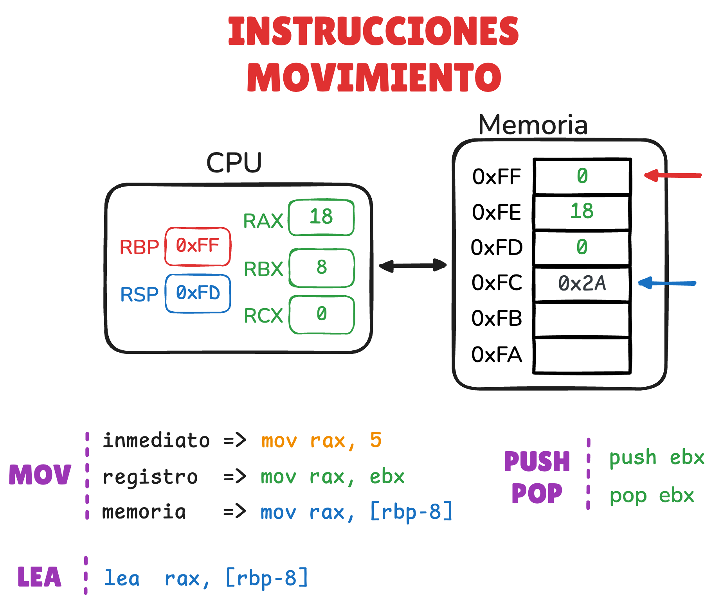
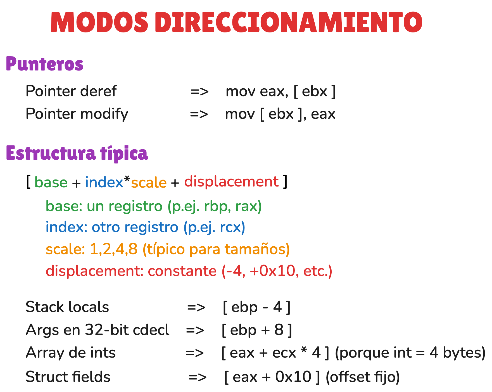
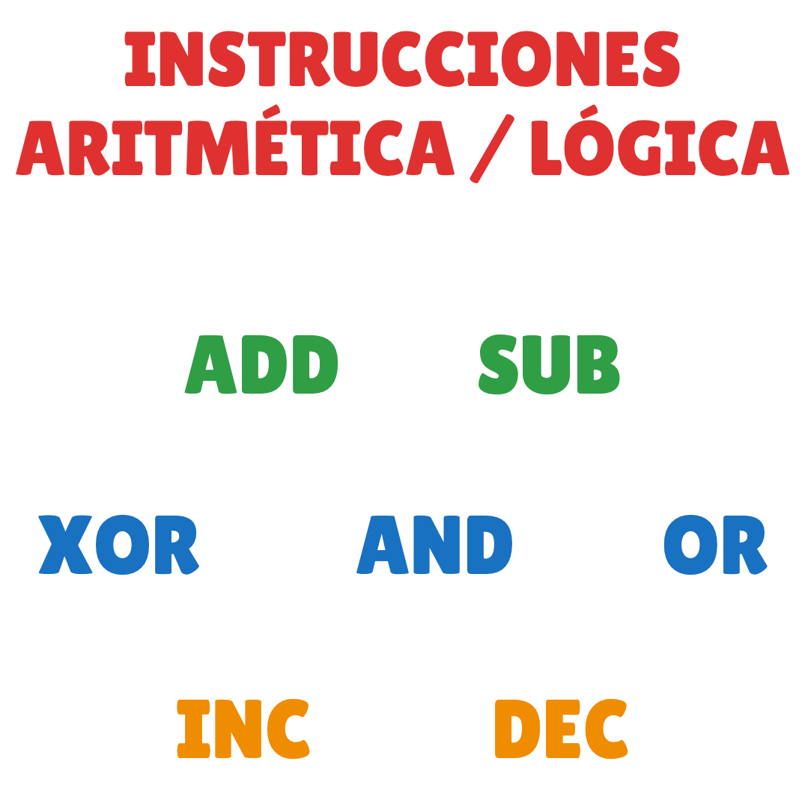
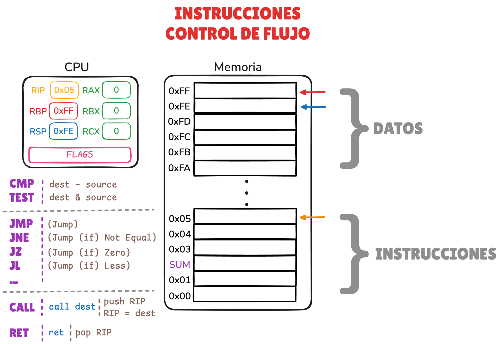
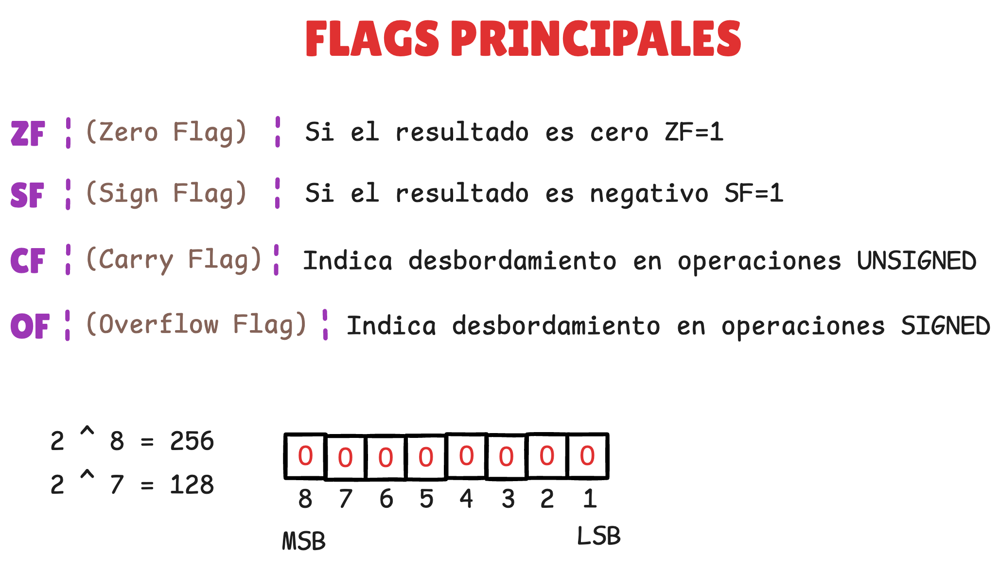
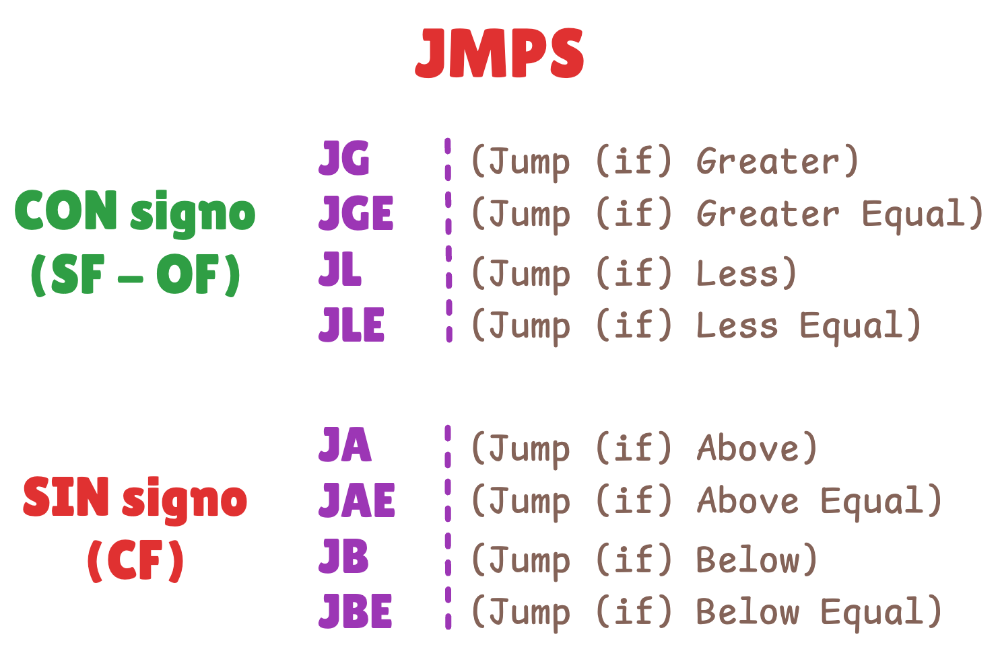

### Enlaces

- **Referencia**
    - [FelixCloutier: x86 and amd64 instruction reference](https://www.felixcloutier.com/x86)
        - Referencia rápida para consultar instrucciones assembly.
        - Aunque para la resolución de los challenges de este repositorio es más que suficiente, es solo para tener una referencia.
        - Para cualquier proyecto serio, consultar documentación oficial como, por ejemplo, el [Intel® 64 and IA-32 Architectures Software Developer Manuals](https://www.intel.com/content/www/us/en/developer/articles/technical/intel-sdm.html).

- **Instrucciones de movimiento**
    - [`MOV`](https://www.felixcloutier.com/x86/mov)
        - Copia un valor desde un origen a un destino (registro, memoria o inmediato).
    - [`LEA`](https://www.felixcloutier.com/x86/lea)
        - Calcula una dirección efectiva y la guarda en un registro (no accede a memoria).
        ---
    - [`PUSH`](https://www.felixcloutier.com/x86/push)
        - Guarda (empuja) un valor en la pila y actualiza `rsp`.
    - [`POP`](https://www.felixcloutier.com/x86/pop)
        - Restaura (saca) un valor de la pila y actualiza `rsp`.

- **Instrucciones aritméticas / lógicas**
    - [`ADD`](https://www.felixcloutier.com/x86/add)
        - Suma el origen al destino (`dest = dest + src`)
    - [`SUB`](https://www.felixcloutier.com/x86/sub)
        - Resta el origen al destino (`dest = dest - src`)
        ---
    - [`XOR`](https://www.felixcloutier.com/x86/xor)
        - XOR bit a bit (`dest = dest XOR src`)
    - [`AND`](https://www.felixcloutier.com/x86/and)
        - AND bit a bit (`dest = dest AND src`)
    - [`OR`](https://www.felixcloutier.com/x86/or)
        - OR bit a bit (`dest = dest OR src`)
        ---
    - [`INC`](https://www.felixcloutier.com/x86/inc)
        - Incrementa en 1 (`dest = dest + 1`)
    - [`DEC`](https://www.felixcloutier.com/x86/dec)
        - Decrementa en 1 (`dest = dest - 1`)

- **Instrucciones de control de flujo**
    - [`CMP`](https://www.felixcloutier.com/x86/cmp)
        - Compara dos operandos actualizando flags (como si hiciera una resta, pero sin guardar el resultado)
    - [`TEST`](https://www.felixcloutier.com/x86/test)
        - AND lógico para flags (no guarda el resultado), típico para comprobar cero
        ---
    - [`JMP`](https://www.felixcloutier.com/x86/jmp)
        - Salto incondicional (siempre salta)
    - [`JCC`](https://www.felixcloutier.com/x86/jcc)
        - `JNE` (jump if not equal)
            - Salta si la comparación anterior determinó "no iguales" (ZF=0)
        - `JZ` (jump if zero / equal)
            - Salta si el resultado anterior fue cero (ZF=1)
        - `JL` (jump if less, signed)
            - Salta si el primer operando era “menor que” el segundo en comparación con signo
        - `...`
        ---
    - [`CALL`](https://www.felixcloutier.com/x86/call)
        - Llama a una función: guarda la dirección de retorno y salta a la función.
    - [`RET`](https://www.felixcloutier.com/x86/ret)
        - Vuelve de una función: restaura la dirección de retorno desde la pila y salta allí.

- **De apoyo**
    - [Medium: Intel vs AT&T Syntax](https://medium.com/@irfanbhat3/intel-vs-at-t-syntax-426fb7a78c96)
        - Artículo donde se comparan ambas sintaxis mediante ejemplos.
    - [C64 Wiki: Processor Status Register](https://www.c64-wiki.com/wiki/Processor_Status_Register)
        - Artículo donde se explica en el registro que almacena los flags.
    - [Luis Llamas: Qué es signed y unsigned en el sistema binario](https://www.luisllamas.es/que-es-signed-unsigned-en-binario)
        - Artículo donde se explica el sistema signed y unsigned

### Documentos

- [diagrama_clase.excalidraw](resources/diagrama_clase.excalidraw)

    - **Modelo de Von Neumann**
    <p align="center">
        
    </p>

    - **Sintaxis**
    <p align="center">
        
    </p>

    - **Instrucciones de movimiento**
    <p align="center">
        
        
    </p>

    - **Instrucciones aritméticas / lógicas**
    <p align="center">
        
    </p>

    - **Instrucciones de control de flujo**
    <p align="center">
        
        
        
    </p>

### Snippets

- Configurar secciones contexto PwnDbg
    ```
    set context-sections regs disasm stack
    ```

### Demos

- Demo sobre instrucciones de movimiento
    - Código
        - [demo_instr_movimiento.s](demos/demo_instr_movimiento.s)
    - Compilación
        ```sh
        gcc -g -O0 -fno-omit-frame-pointer -no-pie demo_instr_movimiento.s -o demo_instr_movimiento
        ```

- Demo sobre instrucciones aritméticas / lógicas
    - Código
        - [demo_instr_arith_logic.s](demos/demo_instr_arith_logic.s)
    - Compilación
        ```sh
        gcc -g -O0 -fno-omit-frame-pointer -no-pie demo_instr_arith_logic.s -o demo_instr_arith_logic
        ```

- Demo sobre instrucciones de control de flujo
    - Código
        - [demo_instr_control_flow.s](demos/demo_instr_control_flow.s)
    - Compilación
        ```sh
        gcc -g -O0 -fno-omit-frame-pointer -no-pie demo_instr_control_flow.s -o demo_instr_control_flow
        ```
