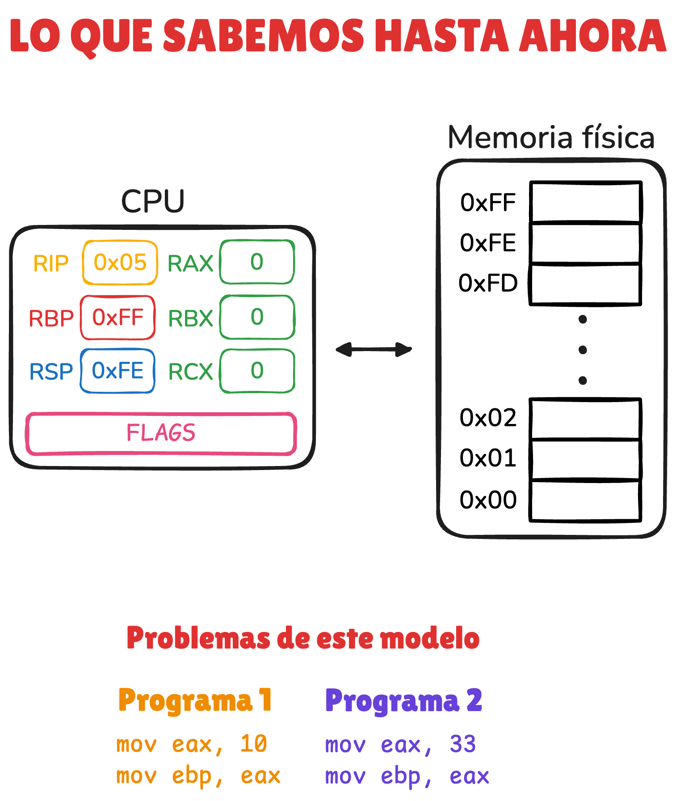
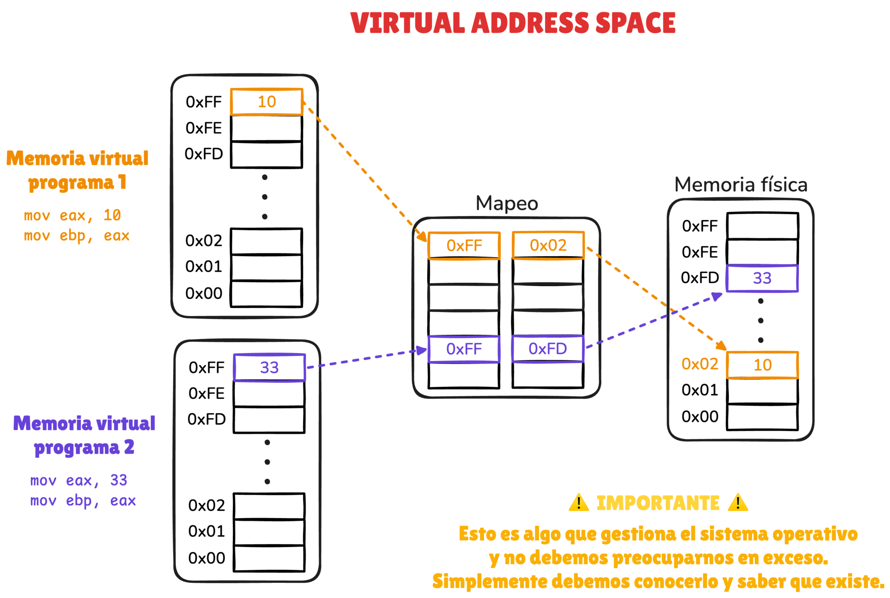
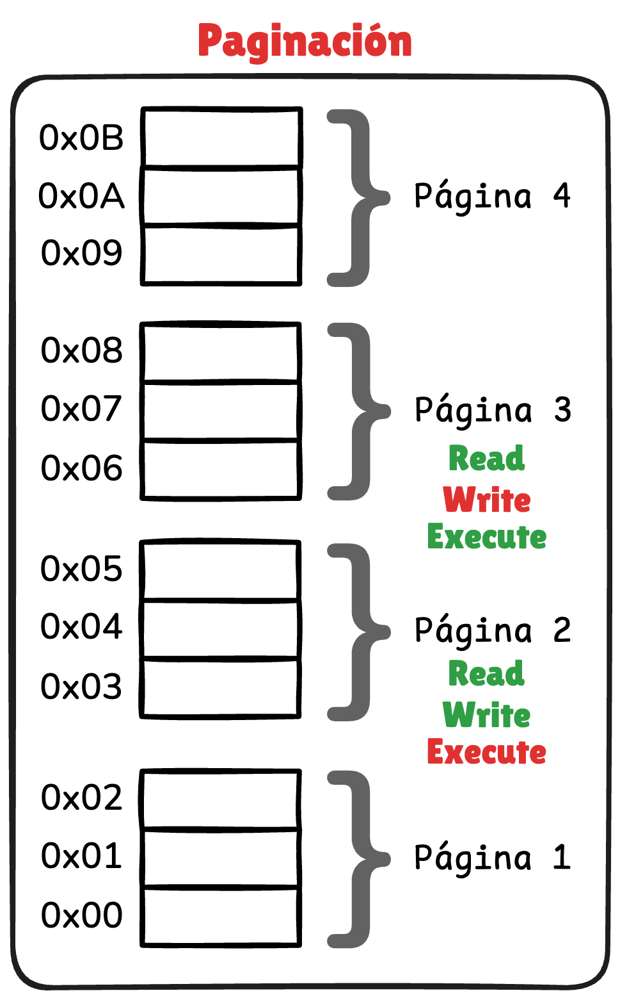
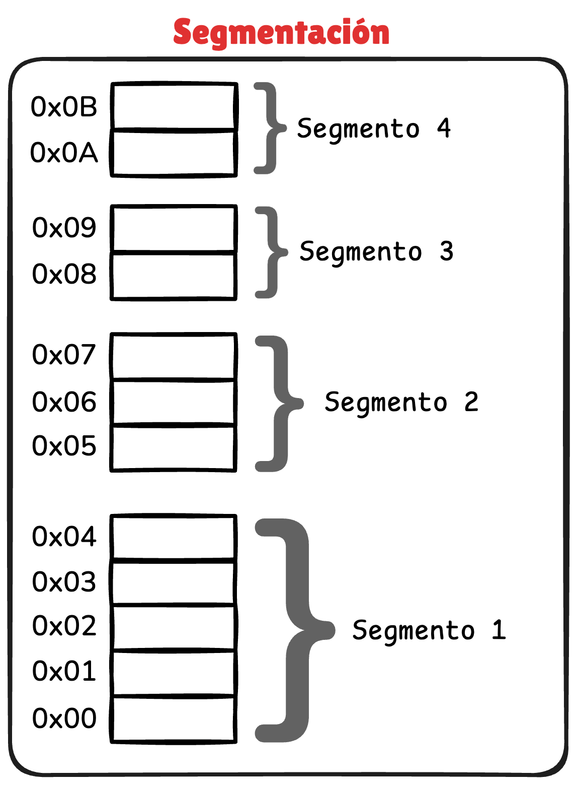
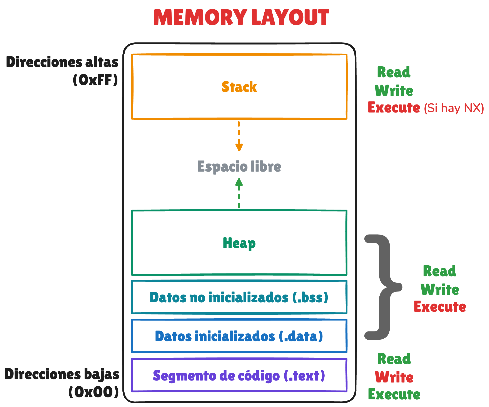
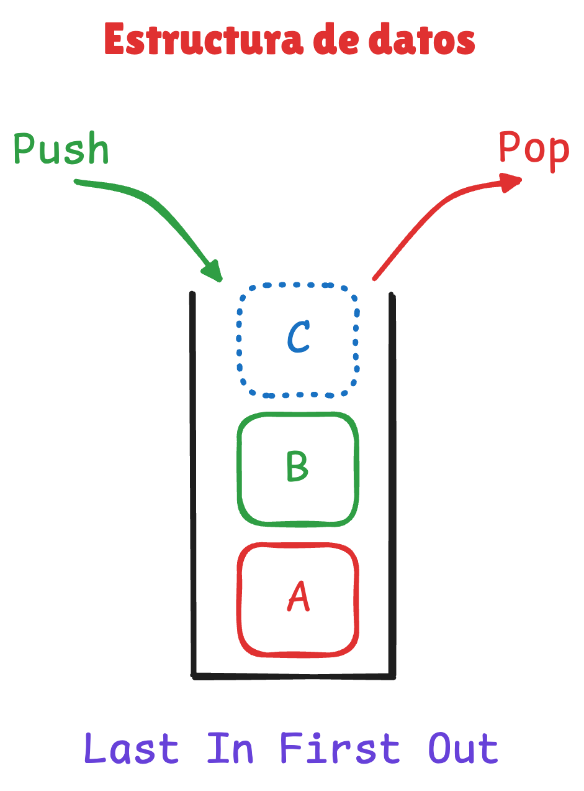
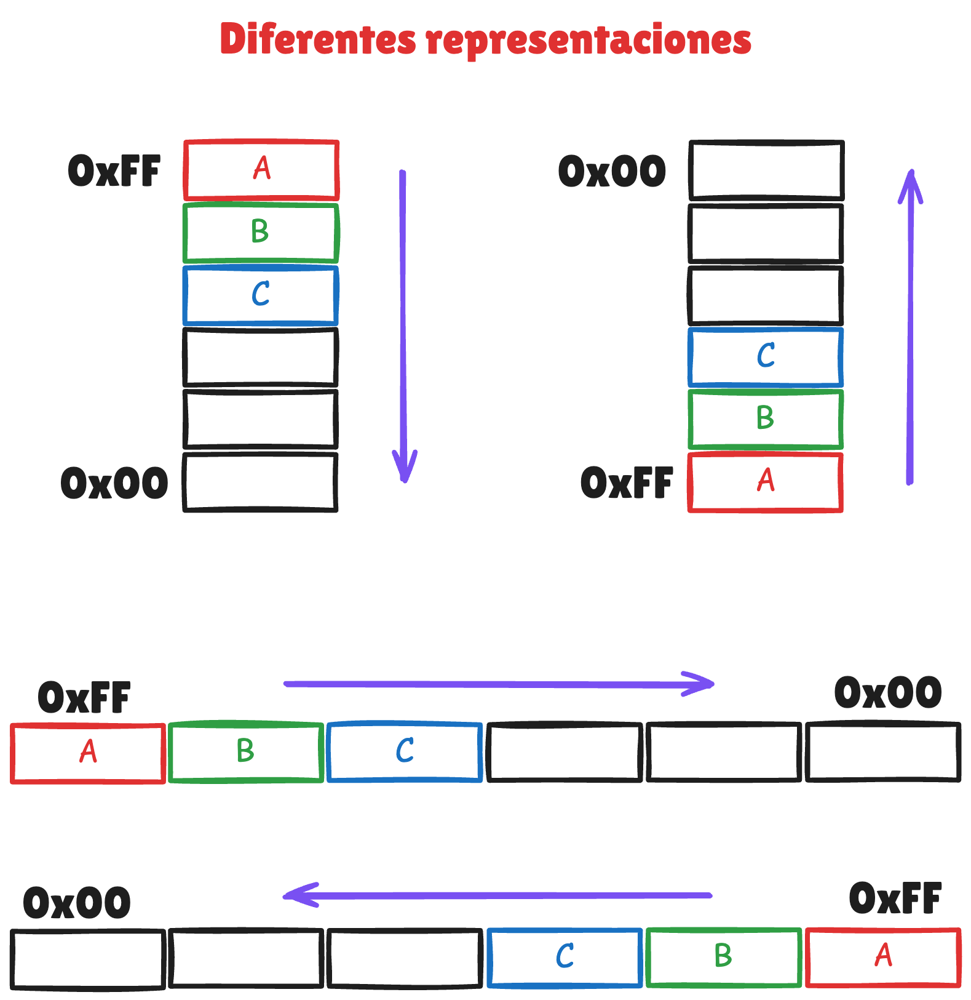
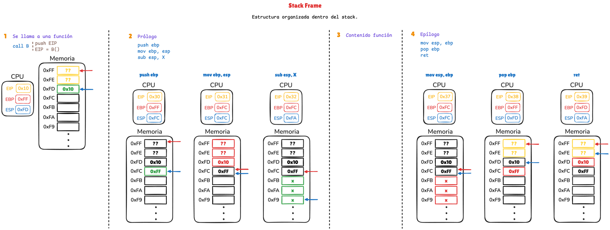
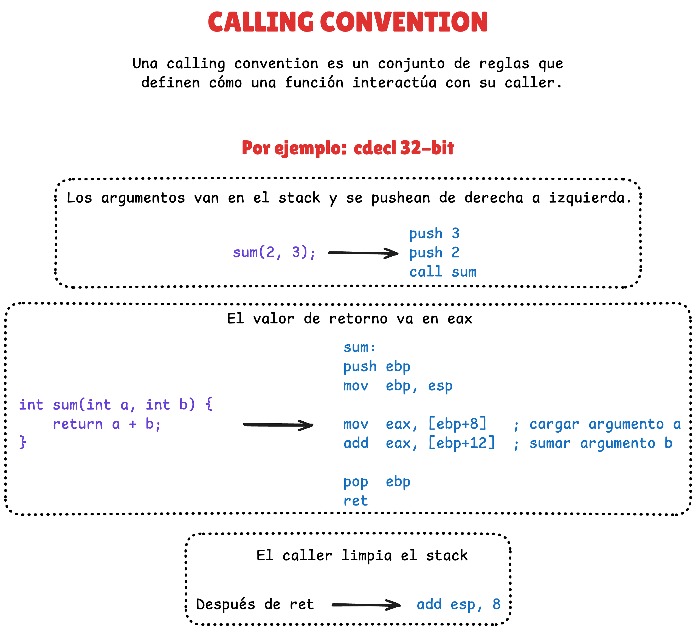

### Enlaces

- **Virtual Memory vs Physical Memory**
    - [GeeksForGeeks: Virtual Memory in Operating System](https://www.geeksforgeeks.org/operating-systems/virtual-memory-in-operating-system)
        - Explica qué es la memoria virtual y cómo el sistema operativo crea un espacio de direcciones independiente para cada proceso.
        - Ayuda a entender por qué las direcciones que vemos en reversing no corresponden directamente con la RAM física.
    - [OsDev: Paging](https://wiki.osdev.org/Paging)
        - Describe el mecanismo de paginación que permite traducir direcciones virtuales a direcciones físicas mediante páginas de memoria.
        - Es útil para entender cómo el hardware y el sistema operativo implementan la memoria virtual.
    - [OsDev: Page Tables](https://wiki.osdev.org/Page_Tables)
        - Explica cómo funcionan las tablas de páginas, las estructuras que almacenan el mapeo entre memoria virtual y memoria física.
        - También muestra cómo se gestionan permisos de memoria y aislamiento entre procesos.
    - [GeeksForGeeks: Segmentation](https://www.geeksforgeeks.org/operating-systems/segmentation-in-operating-system)
        - Introduce el modelo de segmentación de memoria usado históricamente en arquitecturas x86.
        - Ayuda a comprender cómo se dividía la memoria en regiones lógicas antes del uso generalizado de la paginación.

- **Memory Layout**
    - [GeeksForGeeks: Memory Layout of C Programs](https://www.geeksforgeeks.org/c/memory-layout-of-c-program)
        - Describe cómo se organiza la memoria de un programa en ejecución en secciones como `.text`, `.data`, `.bss`, heap y stack.
        - Este modelo ayuda a visualizar dónde viven el código, las variables y las estructuras dinámicas durante la ejecución.

- **El stack**
    - [GeeksForGeeks: Stack Data Structure](https://www.geeksforgeeks.org/dsa/stack-data-structure)
        - Explica la estructura de datos stack y el modelo LIFO (Last In First Out). 
        - Este concepto es la base para entender cómo funciona el stack de un programa a nivel de ejecución.
    - [GeeksForGeeks: Stack Frame in Computer Organization](https://www.geeksforgeeks.org/computer-organization-architecture/stack-frame-in-computer-organization)
        - Describe qué es un stack frame y cómo cada llamada a función crea su propia estructura dentro del stack.
        - Esto permite organizar variables locales, direcciones de retorno y el estado de ejecución.

- **Calling convention**
    - [GeekForGeek: Calling Conventions in C/C++](https://www.geeksforgeeks.org/cpp/calling-conventions-in-c-cpp)
        - Explica las reglas que definen cómo se pasan argumentos, cómo se devuelve un valor y cómo se gestiona el stack durante una llamada a función.
        - Estas convenciones permiten que funciones compiladas por distintos módulos o compiladores puedan interactuar correctamente.

### Documentos

- [diagrama_clase.excalidraw](resources/diagrama_clase.excalidraw)

    - **Repaso**
    <p align="center">
        
    </p>

    - **Espacio de direcciones virtual**
    <p align="center">
        
    </p>

    - **Paginación y segmentación**
    <p align="center">
        
        
    </p>

    - **Memory layout**
    <p align="center">
        
    </p>

    - **El stack**
    <p align="center">
        
        
    </p>

    - **Stack frame**
    <p align="center">
        
    </p>

    - **Calling convention**
    <p align="center">
        
    </p>

### Demos

- Demo sobre memoria y stack
    - Código
        - [demos/demo.c](demos/demo.c)
    - Compilación
        ```sh
        gcc -m32 -fno-pie -no-pie -O0 demo.c -o demo
        ```
