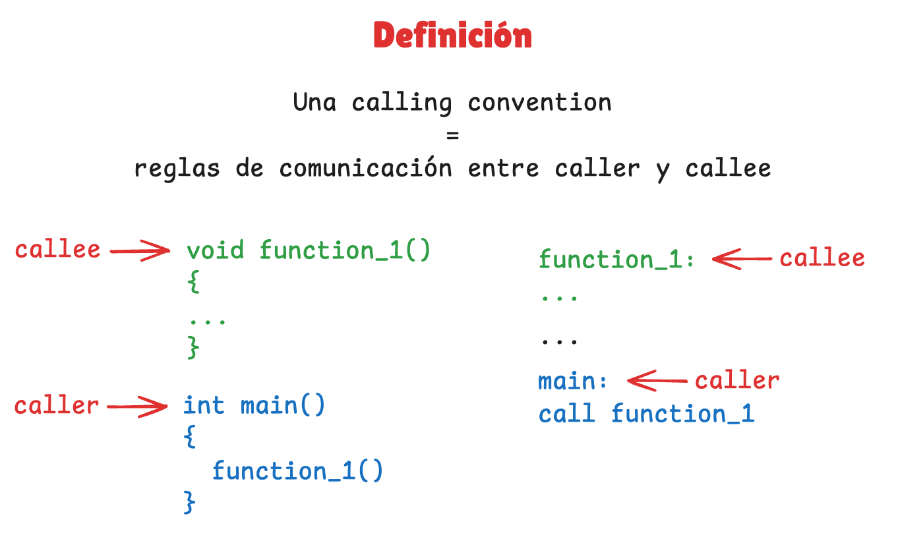
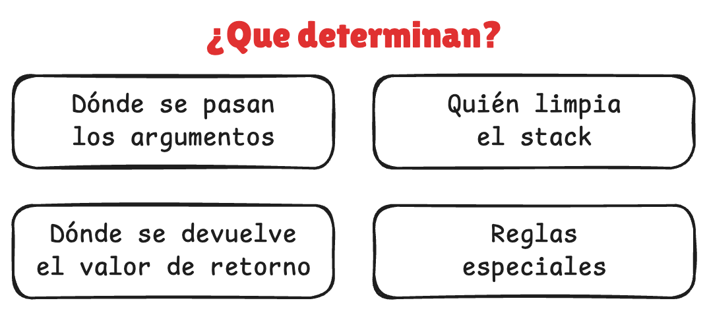
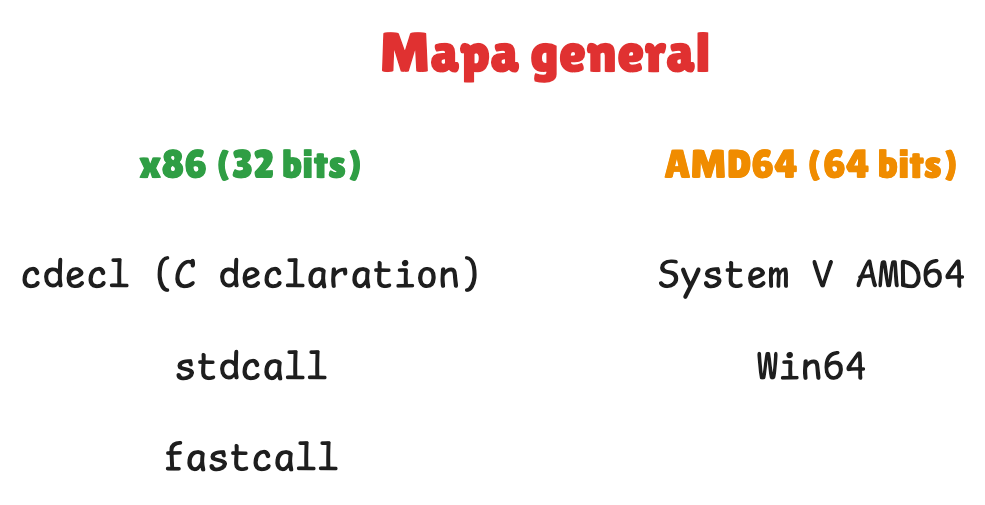
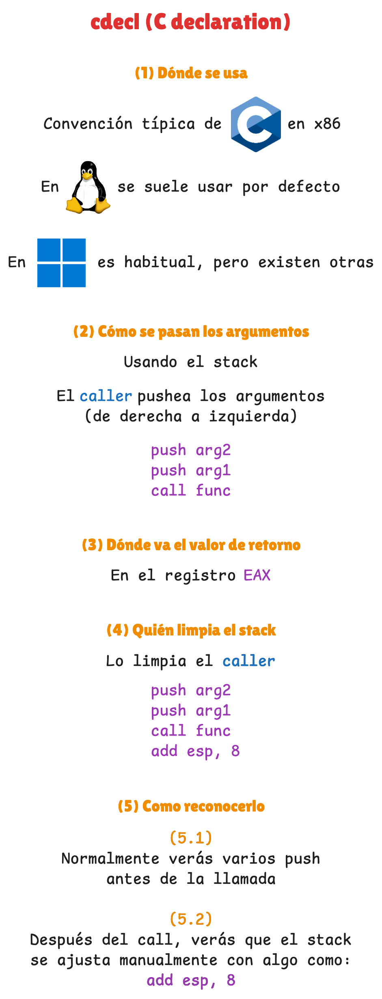
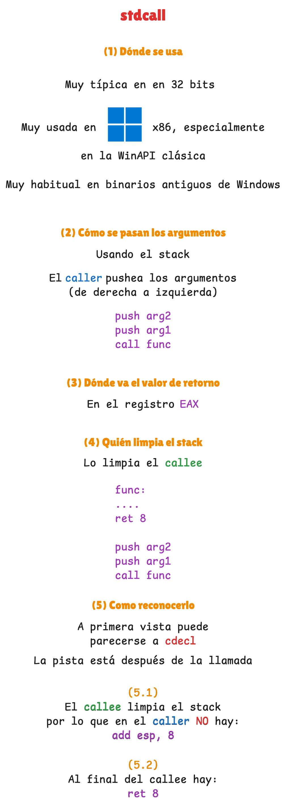
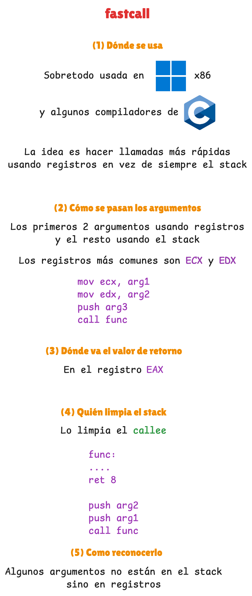
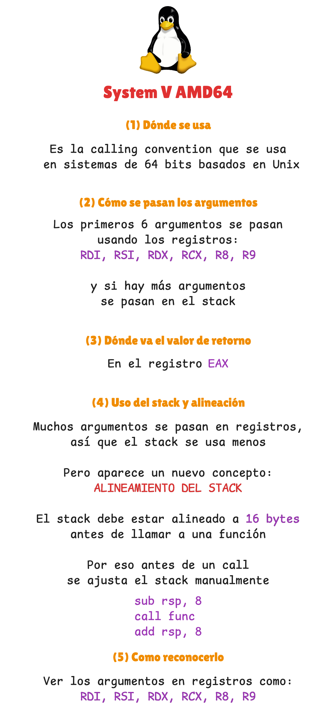
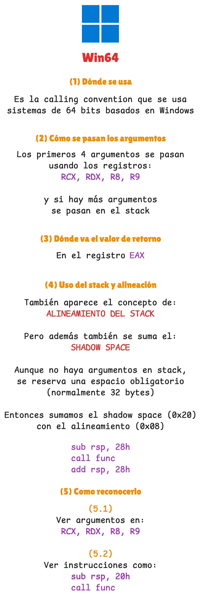
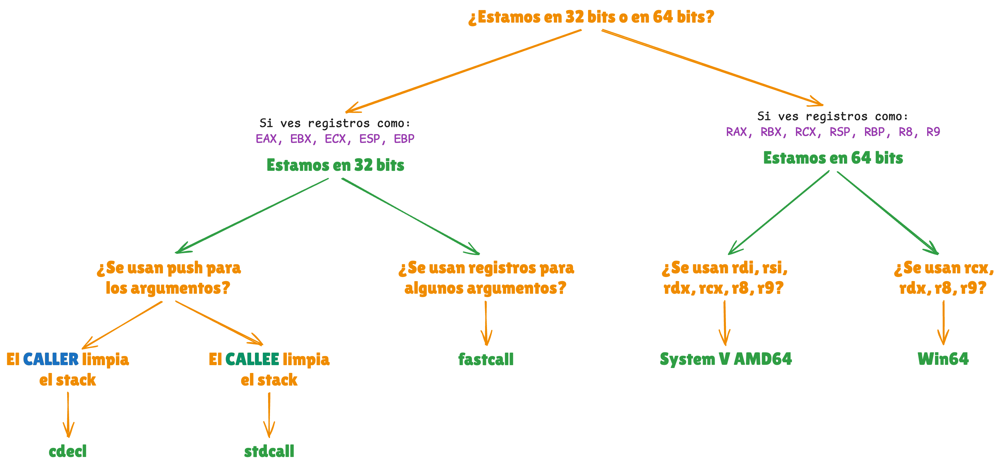

### Enlaces

- **x86**
    - [cdecl](https://learn.microsoft.com/en-us/cpp/cpp/cdecl)
        - Convención de llamada típica en C para x86, donde los argumentos se pasan por el stack y el caller es quien limpia la pila tras la llamada.
    - [stdcall](https://learn.microsoft.com/en-us/cpp/cpp/stdcall)
        - Convención de llamada muy usada en Windows x86, donde los argumentos se pasan por el stack pero la limpieza la realiza la función llamada.
    - [fastcall](https://learn.microsoft.com/en-us/cpp/cpp/fastcall)
        - Convención de llamada en x86 que busca optimizar el rendimiento pasando los primeros argumentos en registros y dejando el resto en el stack.

- **AMD64**
    - [System V AMD64](https://refspecs.linuxfoundation.org/elf/x86_64-abi-0.99.pdf)
        - Convención de llamada usada en sistemas Unix-like de 64 bits, donde los primeros argumentos se pasan en registros como `rdi`, `rsi`, `rdx`, `rcx`, `r8` y `r9`.
    - [Win64](https://learn.microsoft.com/en-us/cpp/build/x64-calling-convention)
        - Convención de llamada estándar en Windows de 64 bits, donde los primeros argumentos se pasan en `rcx`, `rdx`, `r8` y `r9`, y además se reserva shadow space en el stack.

### Documentos

- [diagrama_clase.excalidraw](resources/diagrama_clase.excalidraw)

    - **Introducción**
    

        
    

    

        
        
    

    
    - **x86 (32 bits)**
    <table align="center">
        <tr>
            <td valign="top">
                
            </td>
            <td valign="top">
                
            </td>
            <td valign="top">
                
            </td>
        </tr>
    </table>

    - **AMD64 (64 bits)**
    <table align="center">
        <tr>
            <td valign="top">
                
            </td>
            <td valign="top">
                
            </td>
        </tr>
    </table>

    - **Árbol decisiones**
    

        
    

