### Enlaces

- **Estructura y Formato ELF**
    - [`man elf`](https://man7.org/linux/man-pages/man5/elf.5.html)
        - Documentación técnica oficial que define el formato de archivos ejecutables, de objetos y librerías compartidas en sistemas tipo Unix.
    - [Medium: Basics of ELF (Executable and Linkable Format) file](https://medium.com/@ajmewal/basics-of-elf-executable-and-linkable-format-file-88a516877356)
        - Introducción a las secciones fundamentales del archivo (header, secciones y segmentos) para comprender cómo se almacena el código y los datos.
    - [dev.to: Understanding the Basics of ELF Files on Linux](https://dev.to/bytehackr/understanding-the-basics-of-elf-files-on-linux-61c)
        - Guía detallada sobre la estructura interna del formato ELF y su rol en el ecosistema de Linux.

- **Ejecución y Gestión de Memoria**
    - [wxdublin.gitbooks.io: Programm in Memory](https://wxdublin.gitbooks.io/deep-into-linux-and-beyond/content/address_space.html)
        - Análisis de cómo se mapea un binario en la memoria RAM (stack, heap, data y text) durante su ejecución.

- **Enlazado Dinámico (GOT y PLT)**
    - [Medium: GOT vs PLT in Binary Analysis](https://can-ozkan.medium.com/got-vs-plt-in-binary-analysis-888770f9cc5a)
        - Estudio sobre el redireccionamiento de funciones en tiempo de ejecución y cómo interactúan estas tablas para resolver símbolos externos.
    - [Stack Overflow: Why does the PLT exist in addition to the GOT, instead of just using the GOT?](https://stackoverflow.com/questions/43048932/why-does-the-plt-exist-in-addition-to-the-got-instead-of-just-using-the-got)
        - Discusión técnica sobre la necesidad de separar el código ejecutable (PLT) de los datos modificables (GOT) para permitir el lazy binding.

- **Syscalls**
    - [W3challs: Systemcalls](https://syscalls.w3challs.com)
        - Tabla de referencia para identificar números de llamadas al sistema y sus argumentos según la arquitectura.
    - [System Calls in Linux](https://linuxhandbook.com/system-calls)
        - Explicación de la interfaz entre las aplicaciones de usuario y el kernel, detallando cómo se solicitan servicios de bajo nivel.

### Documentos

- [diagrama_clase.excalidraw](resources/diagrama_clase.excalidraw)

    - **Introducción**
    

        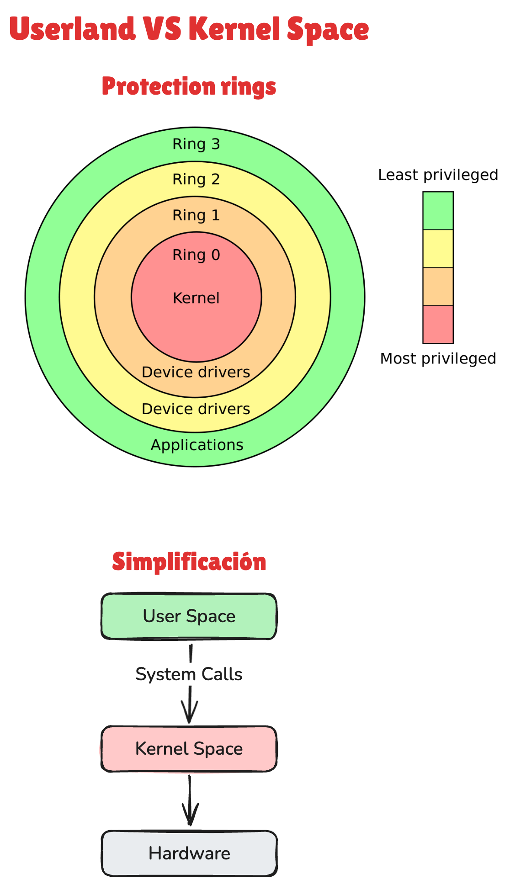
    

    - **Formato ELF**
    

        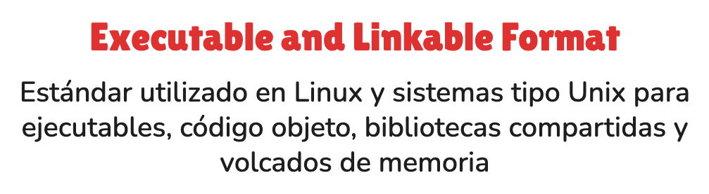
    

    

        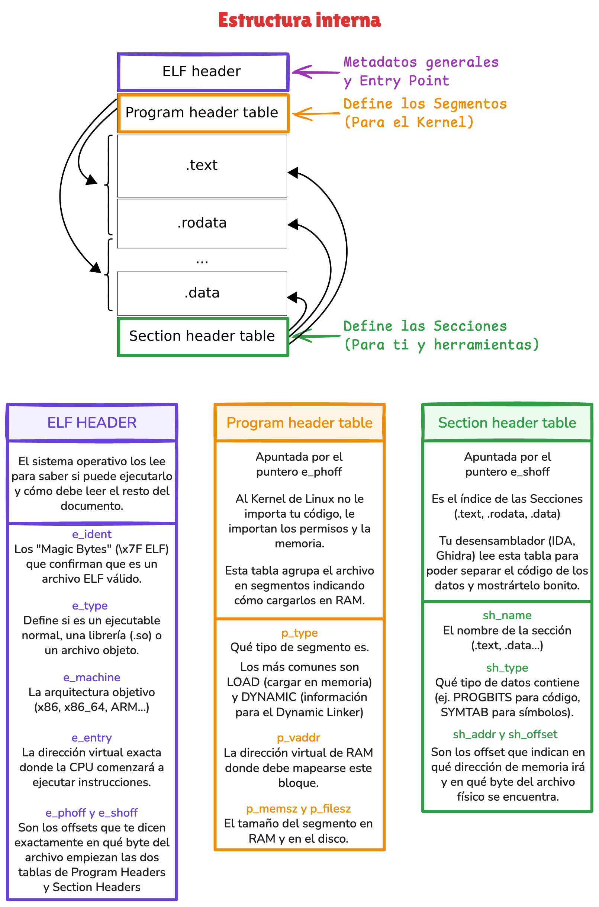
    

    

        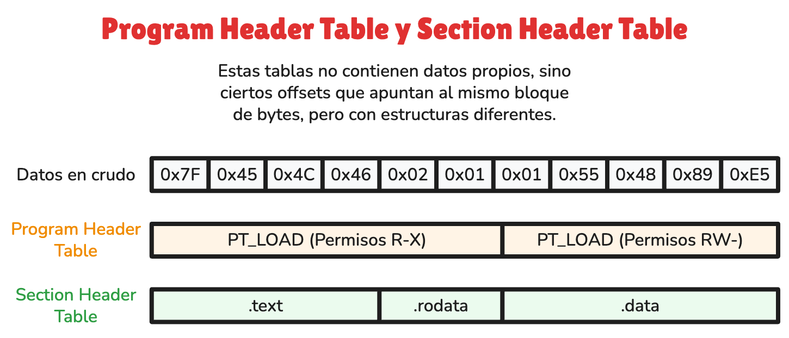
    

    - **Carga y mapeo en memoria**
    

        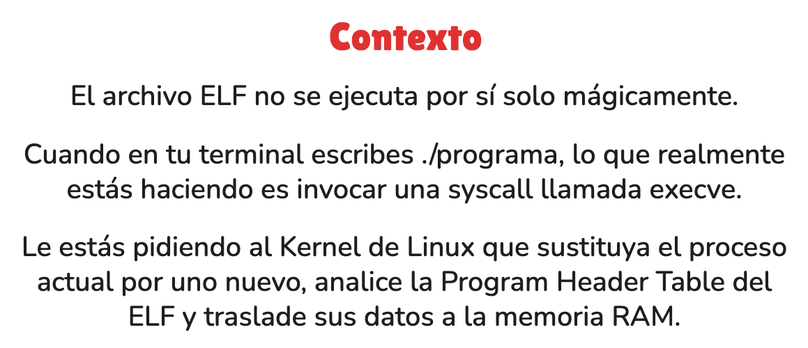
    

    

        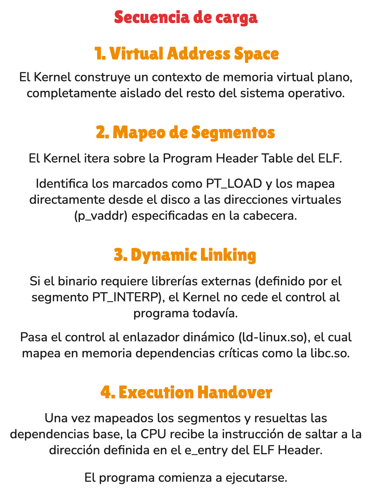
    

    

        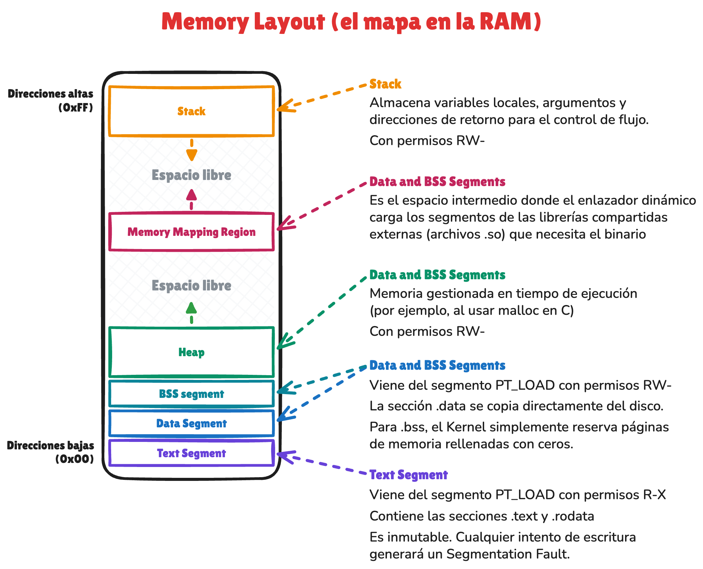
    

    

        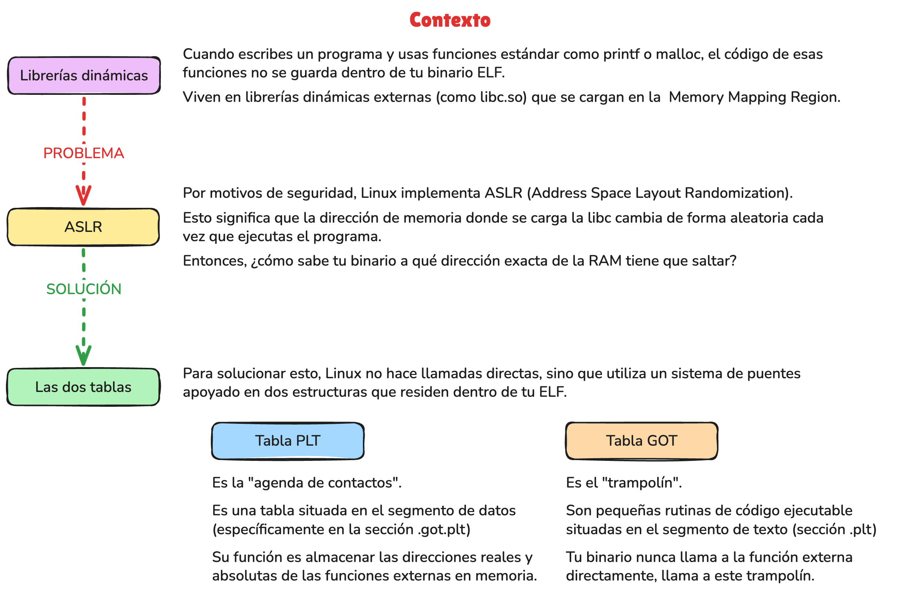
    

    

        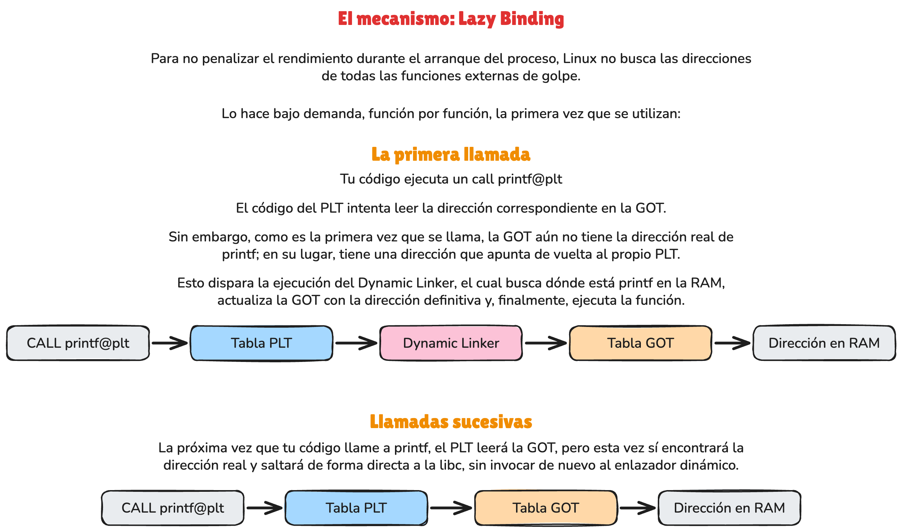
    

    - **Syscall**
    

        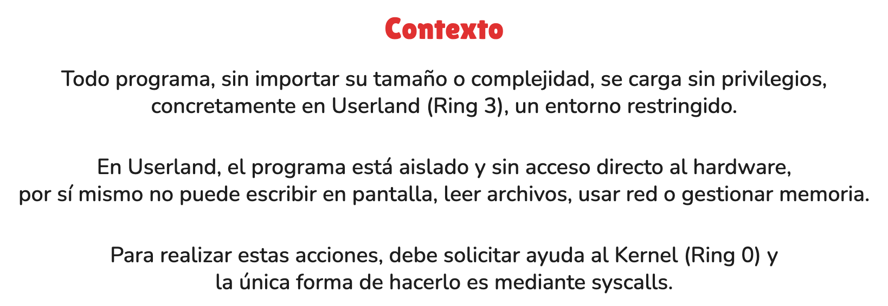
    

    

        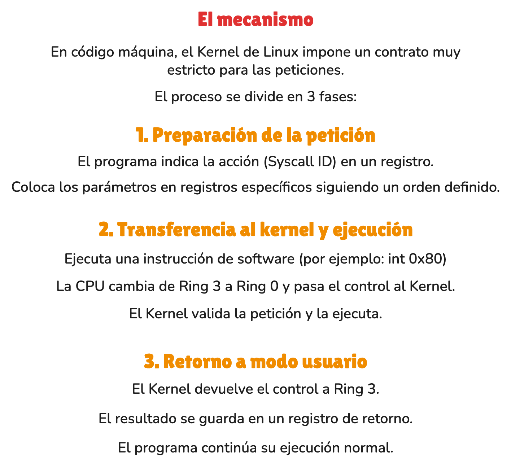
    

