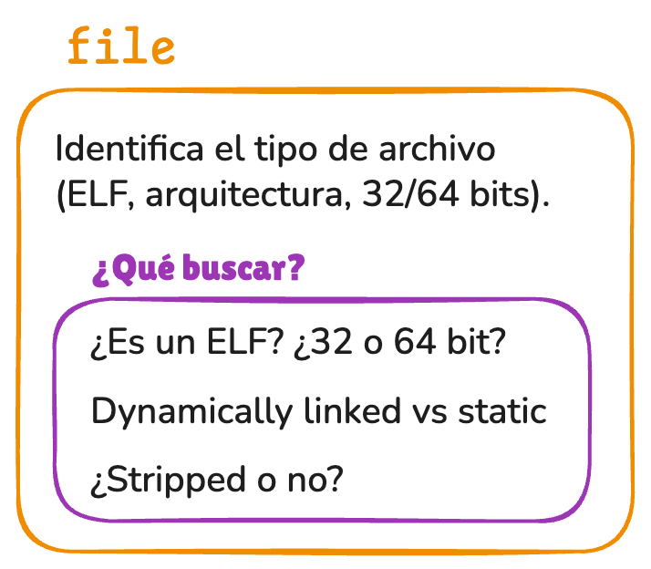
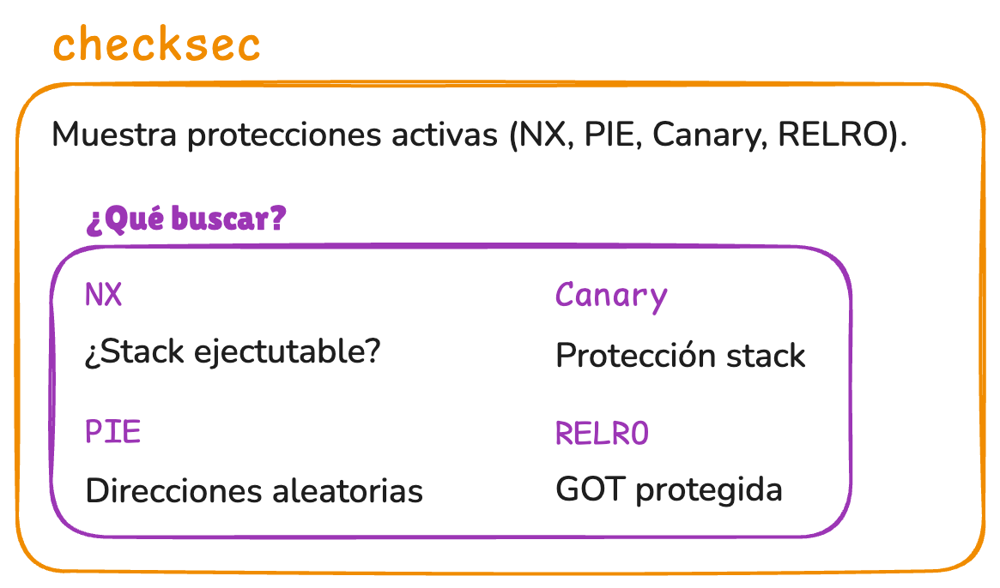
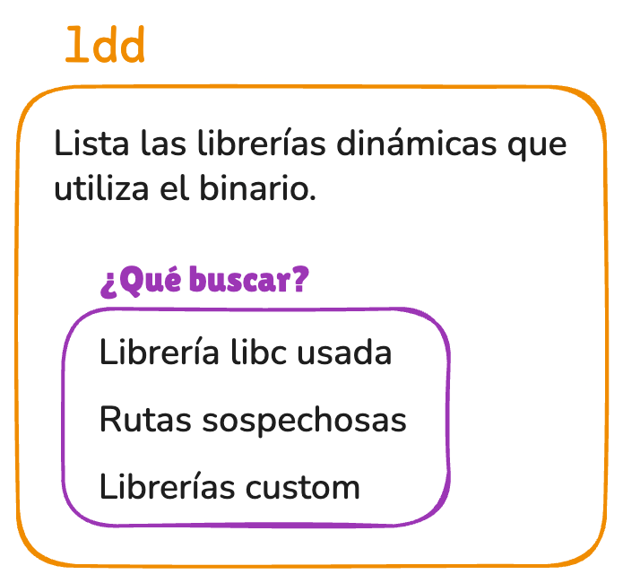
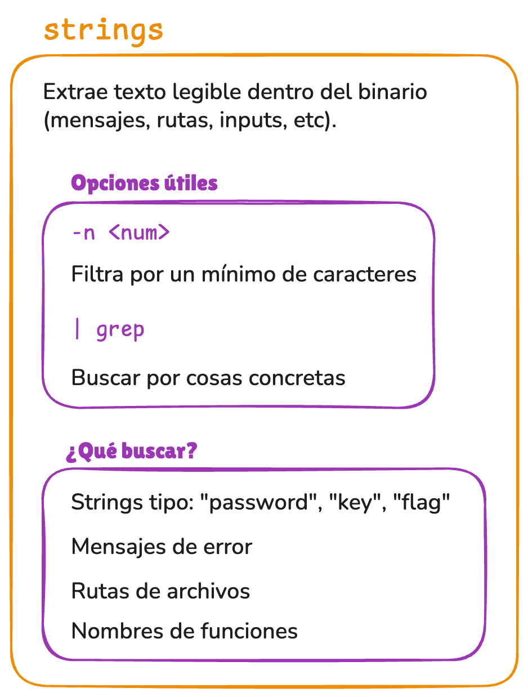
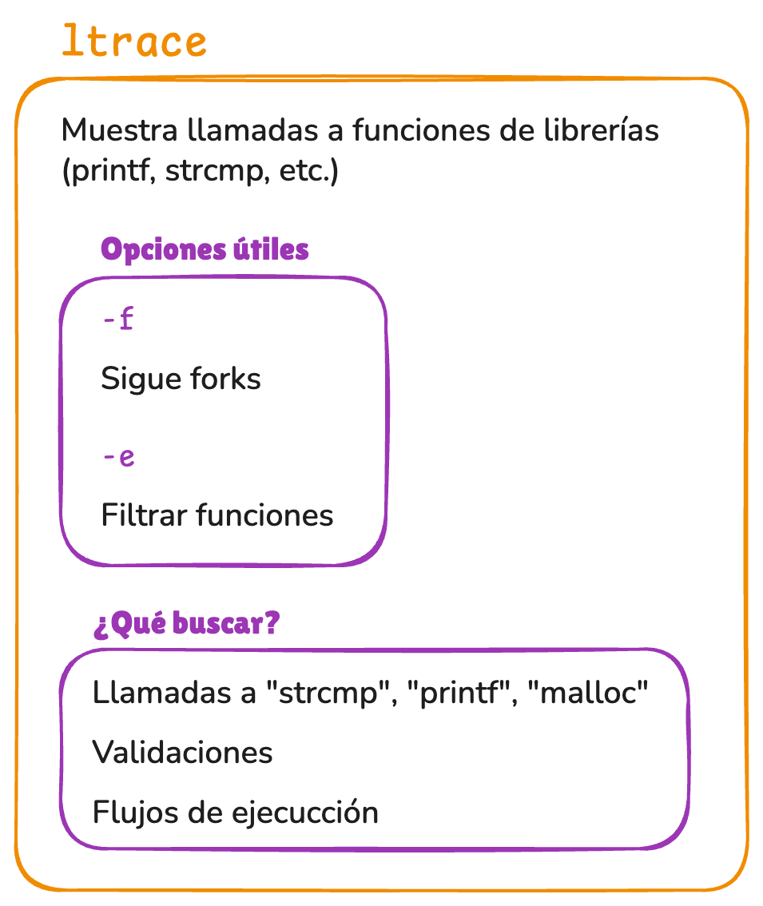
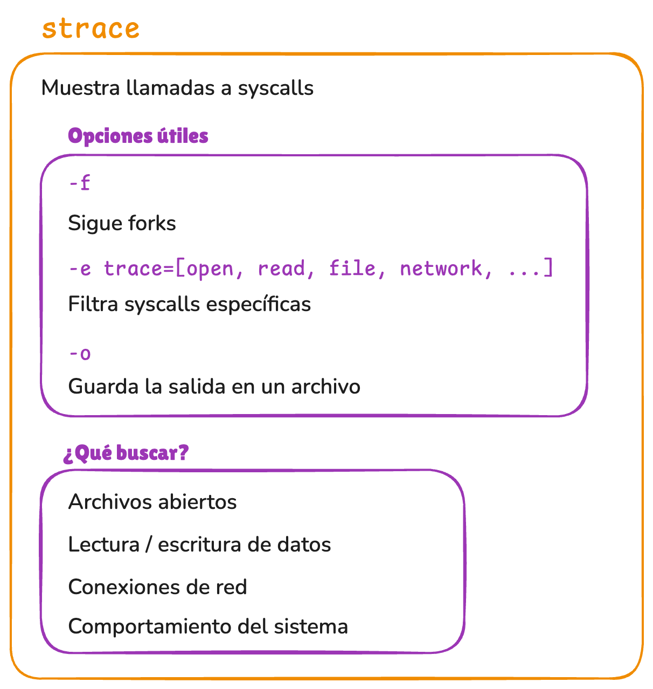
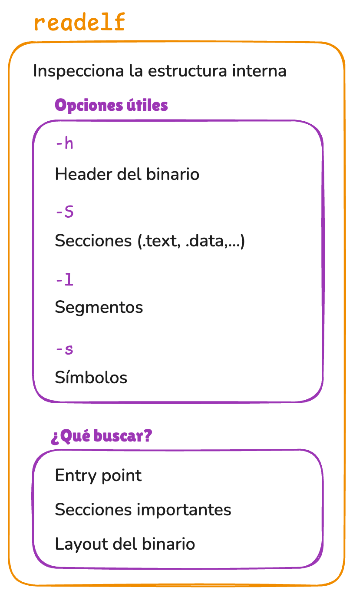
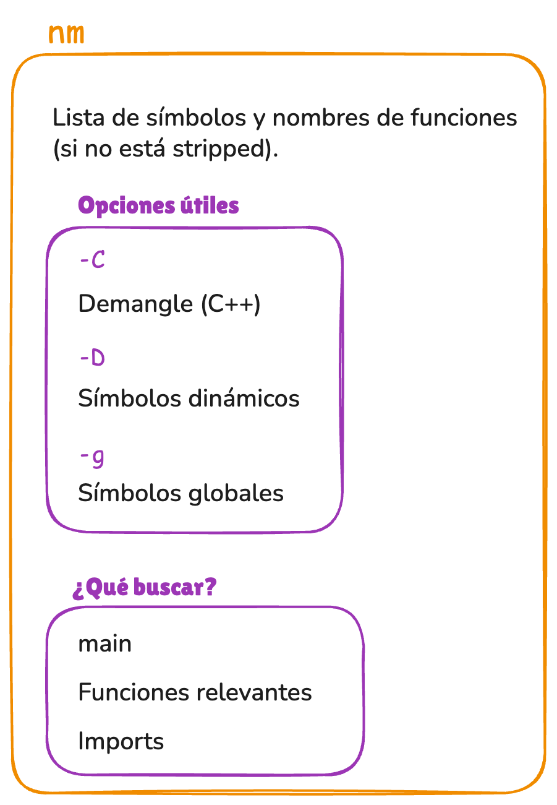
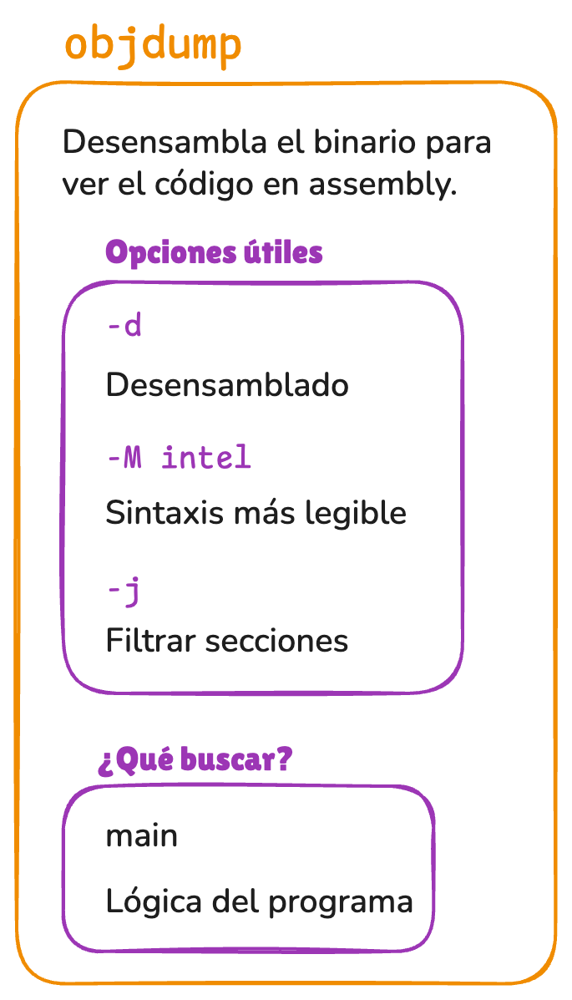
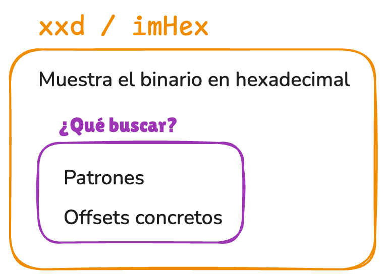

### Enlaces

- **Fase 1: ¿Qué es este binario?**
    - [`man file`](https://man7.org/linux/man-pages/man1/file.1.html)
        - Herramienta básica para identificar el tipo de archivo.
        - En análisis de binarios permite saber rápidamente si se trata de un ejecutable ELF, su arquitectura, si es de 32 o 64 bits, si está enlazado dinámicamente o estáticamente, y si contiene símbolos de depuración.

    - [`man checksec`](https://github.com/slimm609/checksec)
        - Utilidad usada para revisar las protecciones de seguridad activadas en un binario, como NX, Canary, PIE, RELRO y Fortify.
        - Es especialmente útil en reversing y explotación para evaluar qué mitigaciones dificultan ataques como buffer overflows o ret2libc.

    - [`man ldd`](https://www.man7.org/linux/man-pages/man1/ldd.1.html)
        - Muestra las librerías compartidas que necesita un ejecutable para funcionar.
        - Ayuda a identificar dependencias externas, versiones de libc u otras bibliotecas, y posibles funciones importadas que pueden influir en el comportamiento del programa.

- **Fase 2: ¿Hay pistas fáciles?**
    - [`man strings`](https://man7.org/linux/man-pages/man1/strings.1.html)
        - Extrae cadenas de texto legibles dentro de un binario.
        - Puede revelar mensajes de error, rutas, nombres de funciones, URLs, contraseñas hardcodeadas, formatos de entrada esperados o pistas útiles antes de realizar un análisis más profundo.

- **Fase 3: ¿Qué hace al ejecutarse?**
    - [`man ltrace`](https://man7.org/linux/man-pages/man1/ltrace.1.html)
        - Permite observar las llamadas a funciones de librerías dinámicas realizadas por un programa durante su ejecución.
        - Es útil para detectar funciones como printf, strcmp, malloc, puts o scanf, y entender cómo el binario interactúa con bibliotecas externas.
    - [`man strace`](https://man7.org/linux/man-pages/man1/strace.1.html)
        - Monitoriza las llamadas al sistema realizadas por un proceso.
        - Ayuda a ver operaciones como apertura de archivos, lectura, escritura, creación de procesos, acceso a red o interacción con el kernel, permitiendo comprender el comportamiento real del programa en ejecución.

- **Fase 4: ¿Qué hay dentro del binario?**
    - [`man readelf`](https://man7.org/linux/man-pages/man1/readelf.1.html)
        - Herramienta especializada para inspeccionar archivos ELF.
        - Permite consultar cabeceras, secciones, segmentos, símbolos, relocaciones, entradas dinámicas y otra información estructural del binario sin necesidad de ejecutarlo.

    - [`man nm`](https://man7.org/linux/man-pages/man1/nm.1.html)
        - Lista los símbolos presentes en archivos objeto, ejecutables o librerías.
        - Sirve para identificar funciones, variables globales y símbolos importados o exportados, especialmente cuando el binario no ha sido completamente stripped.

    - [`man objdump`](https://man7.org/linux/man-pages/man1/objdump.1.html)
        - Herramienta de análisis que permite desensamblar código máquina, visualizar secciones, consultar símbolos y examinar información interna del binario.
        - Es útil para estudiar instrucciones, flujo de control y llamadas a funciones.

    - [`man xxd`](https://linux.die.net/man/1/xxd)
        - Genera una representación hexadecimal del contenido de un archivo.
        - Permite inspeccionar bytes concretos del binario, localizar patrones, modificar datos manualmente o entender la disposición cruda de la información en disco.

    - [`imHex`](https://imhex.werwolv.net)
        - Editor hexadecimal avanzado con interfaz gráfica, patrones de análisis y herramientas visuales para explorar estructuras binarias.
        - Resulta útil para navegar archivos complejos, interpretar datos internos y comparar regiones del binario de forma más cómoda que con herramientas puramente de terminal.

- **Fase 5: Análisis profundo**
    - [`IDA Free`](https://hex-rays.com/ida-free)
        - Desensamblador y decompilador interactivo usado para realizar ingeniería inversa avanzada.
        - Permite analizar funciones, renombrar símbolos, seguir referencias cruzadas, reconstruir el flujo del programa y comprender la lógica interna del binario con mayor detalle.

    - [`PwnDbg`](https://github.com/pwndbg/pwndbg)
        - Extensión para GDB orientada a explotación y reversing.
        - Mejora la depuración mostrando registros, pila, memoria, desensamblado y estructuras relevantes en tiempo real, facilitando el análisis dinámico de vulnerabilidades y el comportamiento del binario durante la ejecución.

### Documentos

- [diagrama_clase.excalidraw](resources/diagrama_clase.excalidraw)

    - **Fase 1: ¿Qué es este binario?**
    

        
    

    

        
    

    

        
    

    - **Fase 2: ¿Hay pistas fáciles?**
    

        
    

    - **Fase 3: ¿Qué hace al ejecutarse?**
    

        
    

    

        
    

    - **Fase 4: ¿Qué hay dentro del binario?**
    

        
    

    

        
    

    

        
    

    

        
    

    - **Fase 5: Análisis profundo**
    

        
    

    

        
    

