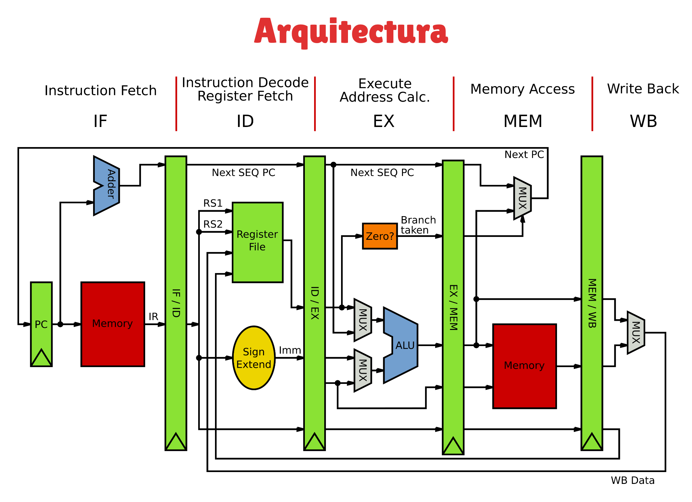
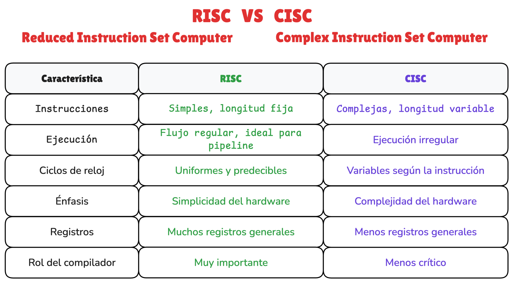
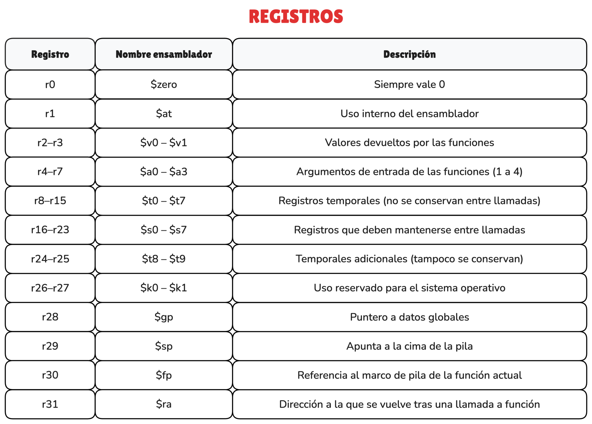
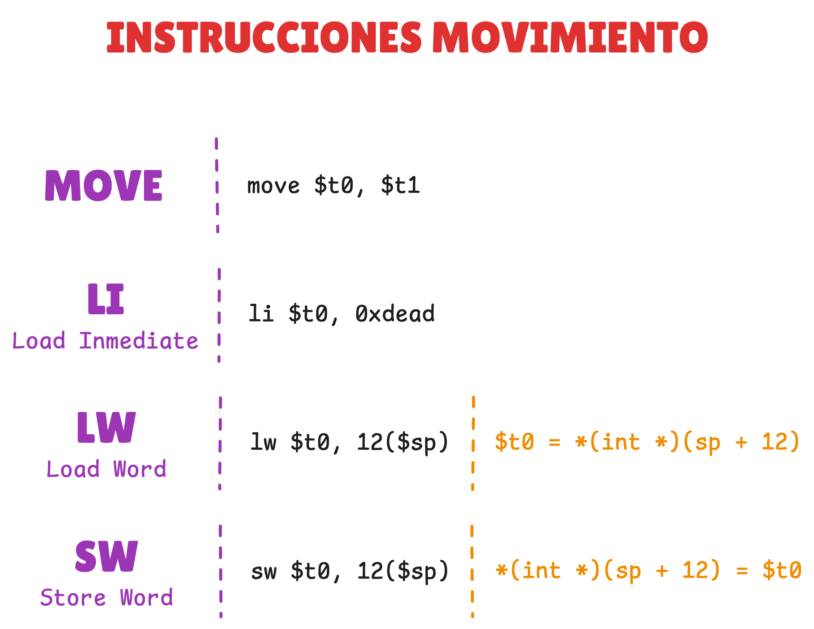
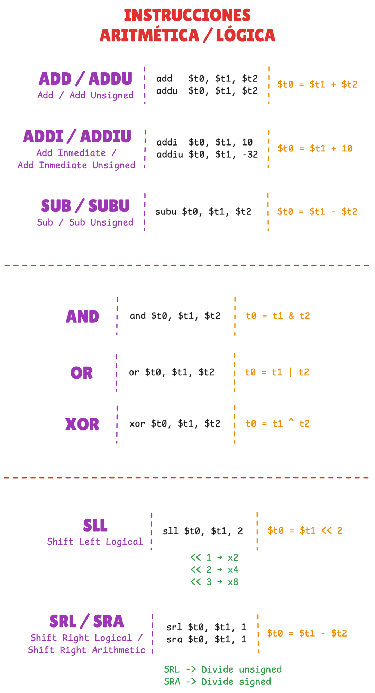
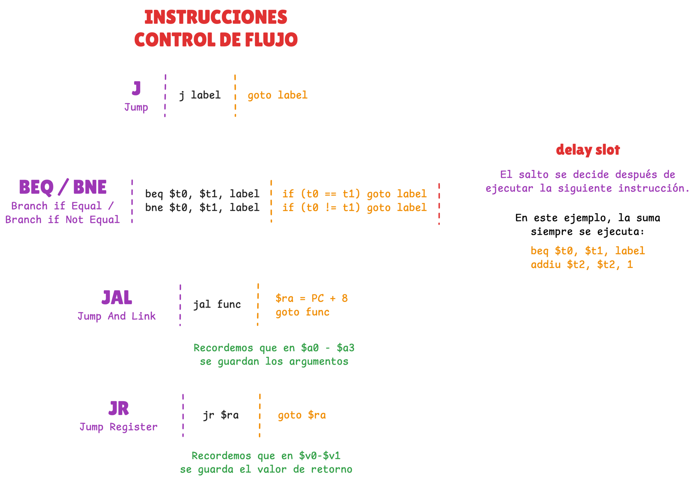
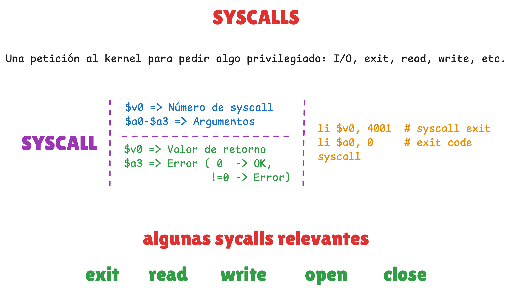

### Enlaces

- **Instruction set**
    - [MIPS32 Architecture For Programmers Volume II: The MIPS32 Instruction Set](https://www.cs.cornell.edu/courses/cs3410/2008fa/MIPS_Vol2.pdf)
        - Documentación oficial para consultar las instrucciones assembly de la arquitectura MIPS.
    - [Training basic MIPS: Instruction Set](https://training.mips.com/basic_mips/PDF/Instruction_Set.pdf)
        - Documento de formación básica de MIPS donde habla del instruction set.

- **Syscalls**
    - [W3challs: Syscalls MIPS o32](https://syscalls.w3challs.com/?arch=mips_o32)
        - Referencia rápida para consultar las llamadas de sistema.

### Documentos

- [diagrama_clase.excalidraw](resources/material_clase/diagrama_clase.excalidraw)

    - **Arquitectura**
    <p align="center">
        
    </p>

    - **RISC vs CISC**
    <p align="center">
        
    </p>

    - **Registros**
    <p align="center">
        
    </p>

    - **Instrucciones de movimiento**
    <p align="center">
        
    </p>

    - **Instrucciones aritméticas / lógicas**
    <p align="center">
        
    </p>

    - **Instrucciones de control de flujo**
    <p align="center">
        
    </p>

    - **Syscalls**
    <p align="center">
        
    </p>

### Snippets

- Instalar herramientas compilación / ejecución / debug
    ```
    sudo apt install gcc-mips-linux-gnu gcc-mipsel-linux-gnu
    sudo apt install qemu-system-mips qemu-user-static
    sudo apt install gdb-multiarch
    ```

- Compilar y ejecutar manualmente
    - Big endian
        ```
        mips-linux-gnu-as demo.s -o demo.o
        mips-linux-gnu-ld demo.o -o demo
        ```
        ```
        chmod +x demo
        qemu-mips ./demo
        ```
    - Little endian
        ```
        mipsel-linux-gnu-as demo.s -o demo.o
        mipsel-linux-gnu-ld demo.o -o demo
        ```
        ```
        chmod +x demo
        qemu-mipsel ./demo
        ```

- Debugear binario
    ```
    qemu-mips -g 1234 ./demo
    ```
    ```
    pwndbg demo
    set show-compact-regs on
    target remote :1234
    ```

### Demos

- Makefile para compilación
    - [demos/Makefile](resources/demos/Makefile)

- Demo inicial para aprender a compilar y ejecutar
    - [demos/hello_world.s](resources/demos/hello_world.s)

- Demos sobre categorías de instrucciones
    - [demos/movement.s](resources/demos/movement.s)
    - [demos/arith.s](resources/demos/arith.s)
    - [demos/flow.s](resources/demos/flow.s)
    - [demos/syscalls.s](resources/demos/syscalls.s)
