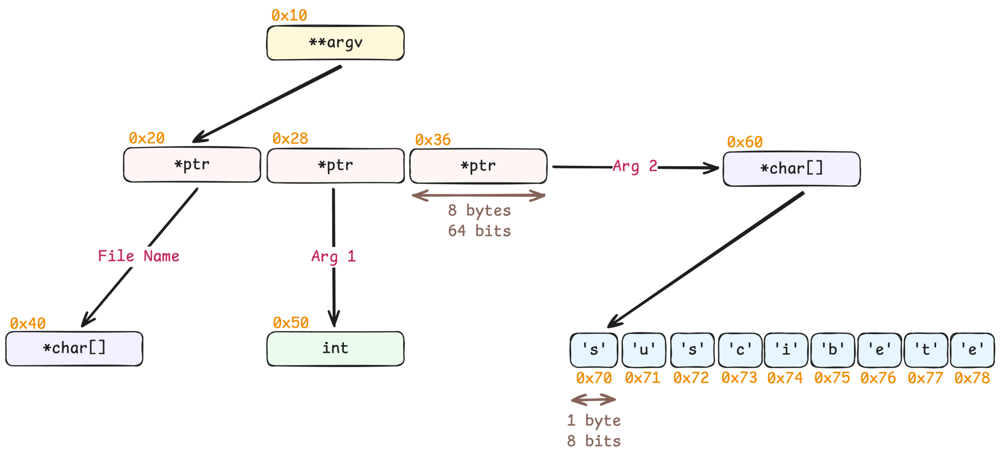

### Enlaces

- **Assembly**
    - [FelixCloutier: x86 and amd64 instruction reference](https://www.felixcloutier.com/x86)
        - Referencia rápida para consultar instrucciones assembly.
        - Aunque para la resolución de los challenges de este repositorio es más que suficiente, es solo para tener una referencia.
        - Para cualquier proyecto serio, consultar documentación oficial como, por ejemplo, el [Intel® 64 and IA-32 Architectures Software Developer Manuals](https://www.intel.com/content/www/us/en/developer/articles/technical/intel-sdm.html).

- **Explotación**
    - [Libreria de Python PwnTools](https://docs.pwntools.com/en/stable)
        - Documentación oficial de la libreria PwnTools.
        - Muy utilizada para crear exploits ya nos simplifica muchos procesos comunes mientras creamos un exploit, en este caso llamar a un proceso con ciertos argumentos, en otros casos abrir una conexión con un server o realizar ciertas manipulaciones de bytes, etc.

- **Tamaños de datos**
    - [Microsoft Learn: Data Type Ranges](https://learn.microsoft.com/en-us/cpp/cpp/data-type-ranges?view=msvc-170)
    - [Stackoverflow: different size of c data type in 32 and 64 bit](https://stackoverflow.com/questions/41365987/different-size-of-c-data-type-in-32-and-64-bit)

- **IDA**
    - [Hex-Rays: Comments in IDA](https://hex-rays.com/blog/igor-tip-of-the-week-14-comments-in-ida)
        - Explicación sobre los diferentes comentarios que existen en IDA.
        - Mayoritariamente usaremos siempre los mismos, pero puede ser útil conocer los diferentes tipos.
    - [Hex-Rays: Patch core](https://docs.hex-rays.com/9.0/user-guide/user-interface/menu-bar/edit/patch-core)
        - Guia sobre el submenu de patching en IDA.
        - Nos permite ver los diferentes metodos de patching.

### Documentos

- [diagrama_argv.excalidraw](resources/diagrama_argv.excalidraw)
    - Diagrama utilizado durante el video para entender como funciona `argv`.
    - Disclaimer: He modificado las direcciones en naranja ligeramente para que tenga más coherencia.

    - **Diagrama de argv**
    <p align="center">
        
    </p>

### Snippets

- Generar string con Perl
    ```sh
    perl -e 'print "A"x20 . "B"x30'
    ```
    ```sh
    ./SimpleKeyGen `perl -e 'print "A"x20 . "B"x30'`
    ```

- Creación entorno virtual Python
    ```sh
    python3 -m venv .venv
    source .venv/bin/activate
    ```
    ```
    pip install pwntools
    ```

### Scripts

- [`scripts/exploit.py`](scripts/exploit.py)
    - Utilizado para automatizar la explotación del binario.
