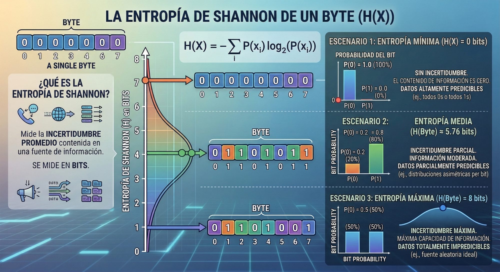

### Enlaces

- **Assembly**
    - [FelixCloutier: x86 and amd64 instruction reference](https://www.felixcloutier.com/x86)
        - Referencia rápida para consultar instrucciones assembly.
        - Aunque para la resolución de los challenges de este repositorio es más que suficiente, es solo para tener una referencia.
        - Para cualquier proyecto serio, consultar documentación oficial como, por ejemplo, el [Intel® 64 and IA-32 Architectures Software Developer Manuals](https://www.intel.com/content/www/us/en/developer/articles/technical/intel-sdm.html).

- **ChaCha20**
    - [Libreria de Pycryptodome - Chacha20](https://pycryptodome.readthedocs.io/en/latest/src/cipher/chacha20.html)
        - Documentación oficial de la libreria Chacha20.
        - Permite utilizar este cifrado simétrico en Python para proteger datos mediante operaciones de cifrado y descifrado, gestionando claves, nonces y flujo de bytes de forma sencilla.
    - [GitHub Ginurx: chacha20-c](https://github.com/Ginurx/chacha20-c)
        - Repositorio de github de la implementación de chacha20 utilizada en el binario.

- **Packers**
    - [UPX: the Ultimate Packer for eXecutables](https://upx.github.io)
        - Web oficial del packer de UPX
        - Permite comprimir ejecutables reduciendo su tamaño y empaquetándolos.

- **Entropía**
    - [Medium: La entropía de Shannon como medida de la incertidumbre y la información potencial. Parte I](https://medium.com/@JuanEnredado/la-entrop%C3%ADa-de-shannon-como-medida-de-la-incertidumbre-parte-i-6a12c4d5d36) y [Parte II](https://medium.com/@JuanEnredado/la-entrop%C3%ADa-de-shannon-como-medida-de-la-incertidumbre-y-la-informaci%C3%B3n-potencial-parte-ii-fc5e32a2b80e)
        - Artículos que explican el concepto de entropía de Shannon dentro de la teoría de la información.
        - Se describe cómo la entropía mide la incertidumbre o cantidad de información presente en un conjunto de datos, un concepto muy utilizado en áreas como criptografía, compresión de datos y análisis de malware.

### Documentos

- **Infografía: entropía de Shannon**

    <p align="center">
        
    </p>

### Snippets

- Creación entorno virtual Python
    ```sh
    python3 -m venv .venv
    source .venv/bin/activate
    ```
    ```
    pip install pycryptodome
    ```

### Scripts

- [`scripts/decrypt.py`](scripts/decrypt.py)
    - Utilizado para automatizar el desencriptado de la flag.
