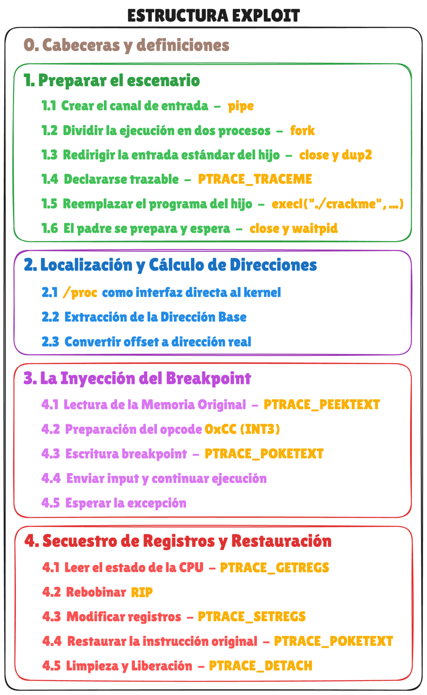

### Enlaces

- **Análisis**
    - Función [`time`](https://man7.org/linux/man-pages/man3/time.3p.html) (`man 3 time`)
        - Obtiene el tiempo actual en segundos desde el Epoch.
    - Función [`clock_gettime`](https://man7.org/linux/man-pages/man3/clock_gettime.3.html) (`man 3 clock_gettime`)
        - Recupera el valor actual de un reloj del sistema con precisión de nanosegundos.
    - Función [`snprintf`](https://man7.org/linux/man-pages/man3/snprintf.3p.html) (`man snprintf`)
        - Escribe texto formateado en un buffer limitado.
        - Evita desbordamientos y permite construir strings dinámicos.
    - Función [`strcmp`](https://man7.org/linux/man-pages/man3/strcmp.3.html) (`man strcmp`)
        - Compara dos cadenas byte a byte.

- **Script – Bloque 1 (Preparar el escenario)**
    - Función [`pipe`](https://man7.org/linux/man-pages/man3/pipe.3p.html) (`man 3 pipe`)
        - Crea una tubería unidireccional gestionada por el kernel.
        - Permite redirigir la entrada del programa objetivo sin interacción manual.
    - Función [`fork`](https://man7.org/linux/man-pages/man2/fork.2.html) (`man 2 fork`)
        - Duplica el proceso actual creando un hijo.
        - Ambos comparten descriptores de fichero y estado inicial.
    - Función [`close`](https://man7.org/linux/man-pages/man3/close.3p.html) (`man 3 close`)
        - Cierra un descriptor de fichero.
        - Necesario para controlar correctamente pipes y redirecciones.
    - Función [`dup2`](https://man7.org/linux/man-pages/man3/dup.3p.html) (`man 3 dup2`)
        - Duplica un descriptor sobre otro descriptor concreto.
        - Muy usada para redirigir stdin / stdout / stderr.
    - Syscall [`ptrace`](https://man7.org/linux/man-pages/man2/ptrace.2.html) (`man 2 ptrace`)
        - Permite a un proceso inspeccionar y controlar otro proceso.
        - Base de debuggers, tracers y muchos exploits de reversing.
    - Función [`execl`](https://man7.org/linux/man-pages/man3/exec.3.html) (`man 3 execl`)
        - Reemplaza la imagen del proceso por otro programa.
        - Mantiene PID pero cambia completamente el código en memoria.
    - Función [`waitpid`](https://man7.org/linux/man-pages/man3/waitpid.3p.html) (`man 3 waitpid`)
        - Espera cambios de estado de un proceso hijo.
        - Permite detectar paradas, señales y finalización.

- **Script – Bloque 2 (ASLR y cálculo de direcciones)**
    - Filesystem [`proc`](https://man7.org/linux/man-pages/man5/proc.5.html) (`man 5 proc`)
        - Sistema de ficheros virtual que expone información interna del kernel.
        - Cada proceso tiene su propio directorio en `/proc/<pid>`.
    - Fichero [`/proc/pid/maps`](https://man7.org/linux/man-pages/man5/proc_pid_maps.5.html) (`man 5 proc_pid_maps`)
        - Muestra el mapa de memoria de un proceso.
        - Permite conocer direcciones reales cuando ASLR está activo.

- **Script – Bloque 3 (Breakpoints y señales)**
    - Función [`wait`](https://man7.org/linux/man-pages/man2/wait.2.html) (`man 2 wait`)
        - Espera cambios en el estado de procesos hijos.
        - Se usa junto a macros para interpretar el motivo de la parada, por ejemplo las macros `WIFSTOPPED` y `WSTOPSIG`:
            - Permiten comprobar si el proceso fue detenido por una señal.
            - Usadas para detectar SIGTRAP tras un breakpoint.
    - Señales [`signal`](https://man7.org/linux/man-pages/man7/signal.7.html) (`man 7 signal`)
        - Sistema de señales del kernel.
        - Permite detectar eventos como interrupciones o excepciones.
        - Por ejemplo la señal `SIGTRAP`:
            - Señal enviada cuando se ejecuta un breakpoint.
            - Usada por debuggers y ptrace.
        - Instrucción x86 [`INT3`](https://www.felixcloutier.com/x86/intn:into:int3:int1)
            - Opcode `0xCC`
            - Usada para insertar breakpoints en memoria.

- **Script – Bloque 4 (Registros y manipulación de CPU)**
    - Estructura [`user_regs_struct`](https://elixir.bootlin.com/linux/latest/source/arch/x86/include/asm/user_64.h)
        - Representa el estado de los registros de CPU en x86_64.
        - Usada con ptrace para leer y modificar registros.

### Documentos

- [estructura_exploit.excalidraw](resources/estructura_exploit.excalidraw)

    - **Estructura del exploit**
    <p align="center">
        
    </p>

### Snippets

- Compilación exploit
    ```
    gcc -Wall -Wextra -O2 exploit.c -o exploit
    ```

### Scripts

- [`scripts/exploit.c`](scripts/exploit.c)
    - Utilizado para automatizar la explotación del binario.
