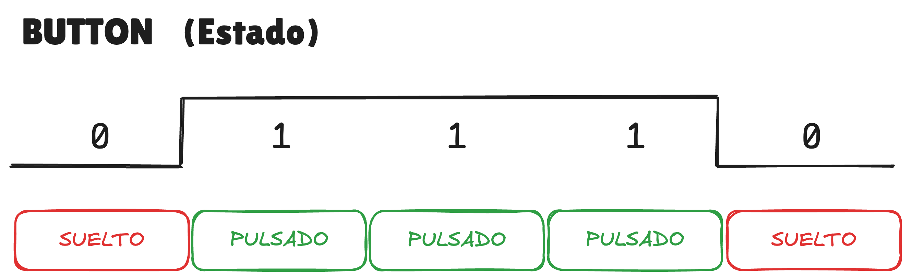
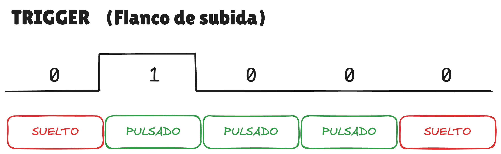

### Enlaces

- **Mando (N64)**
    - [ultra64: `nuContDataGetEx`](https://ultra64.ca/files/documentation/online-manuals/functions_reference_manual_2.0i/nusys/nuContDataGetEx.html)
        - Función encargada de leer los datos del mando y guardarlos en una estructura `NUContData`.
    - [Github n64sdkmod: nusys/nusys.h - `NUContData`](https://github.com/ModernN64SDKArchives/n64sdkmod/blob/master/packages/libnusys/usr/include/n64/nusys/nusys.h#L522)
        - Estructura que almacena el estado del mando, incluyendo la trigger data.
    - [Github n64sdkmod - PR/os_cont.h - `Buttons`](https://github.com/ModernN64SDKArchives/n64sdkmod/blob/d27d200a34b5b4f6dcde092153fdc67157b8a8ae/packages/n64sdk/usr/include/n64/PR/os_cont.h#L121)
        - Defines de las máscaras de bits de los diferentes botones.

- **Herramientas**
    - [Project64](https://www.pj64-emu.com)
        - Emulador gratuito y opensource para ejecutar las ROMs de Nintendo64 en PC.
    - [Plugin Ghidra: N64LoaderWV](https://github.com/zeroKilo/N64LoaderWV)
        - Plugin para Ghidra que permite cargar ROMs de Nintendo 64 (.z64, .n64, .v64) correctamente, ajustando la endianness y mapeando secciones de RAM/ROM/boot.

- **Referencia**
    - [GeeksforGeeks: Structure Member Alignment, Padding and Data Packing](https://www.geeksforgeeks.org/c/structure-member-alignment-padding-and-data-packing)
        - Explicación sobre como el compilador de C organiza los miembros de una estructura mediante alineación y relleno para que cada dato quede en direcciones óptimas para la CPU.
    - [Arquitectura de la Nintendo 64](https://www.copetti.org/es/writings/consoles/nintendo-64)
        - Análisis técnico y detallado de la arquitectura interna de la consola Nintendo 64.
        - Explica cómo están diseñados y funcionan su CPU, memoria, gráficos, audio, sistema operativo y otros subsistemas.
        - También incluye decisiones de diseño y limitaciones que la hacen única dentro de las consolas de su generación.

### Documentos

- Diagramas utilizados durante el video para entender la diferencia entre button y trigger

    - **Button**
    

        
    

    - **Trigger**
    

        
    

